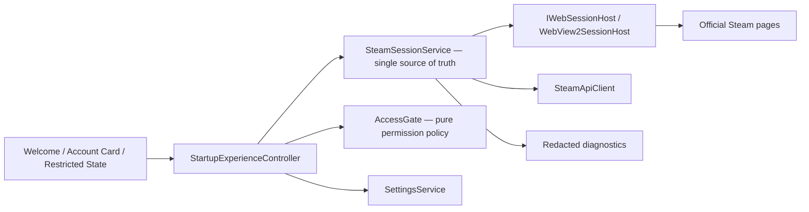
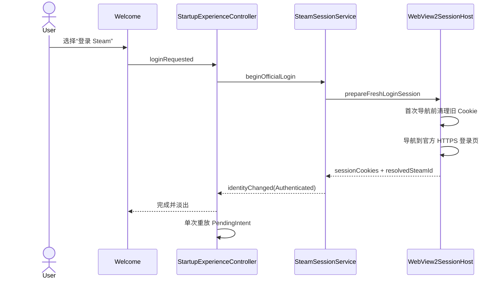

# CR-004 账户入口与游客模式架构设计（G2）

## 1. 设计目标

在不新增自建账户体系、不保存 Steam 凭据的前提下，为应用建立可解释、可恢复的启动身份入口。设计延续 CR-003 的官方 Steam Web 登录与 WebView2 会话桥，不建立第二套认证实现。

核心约束：

- 启动时先明确“游客浏览”或“登录 Steam”；
- 游客模式不触发登录、不生成伪造账户态；
- 私有库存与账户动作必须经过统一权限门；
- Steam Cookie 仅在当前进程内使用，重启后不得自动恢复认证；
- `--smoke-test` 固定进入游客态，测试不依赖网络与真实账户；
- UI 只消费身份快照，不通过页面可见性推断登录状态。

## 2. 方案选择

采用“扩展现有会话服务 + 新增启动体验控制器”的方案：

- `SteamSessionService` 升级为唯一身份状态源，持有显式状态机并桥接 CR-003 会话；
- `StartupExperienceController` 仅负责编排欢迎页、待执行意图和导航，不保存 Cookie；
- `AccessGate` 为纯函数权限映射，页面和命令共用；
- `AccountEntryOverlay`、`AccountCard`、`AccessPrompt` 只通过契约发出用户意图。

未采用：

- 新建独立 AuthService：会与 CR-003 形成双状态源；
- 将游客表示成空 SteamID：无法区分“未选择”“游客”“会话失效”；
- 持久化 WebView 登录：超出本变更隐私边界，也会削弱可解释性。

## 3. 模块与依赖



依赖规则：

1. UI 不直接读取 Cookie、SteamID 缓存或 WebView 状态。
2. `StartupExperienceController` 不实现认证，只调用 `SteamSessionService::beginOfficialLogin()`。
3. `AccessGate` 不访问网络、数据库或 UI。
4. `SettingsService` 仅保存启动偏好，不保存身份快照。
5. CR-003 的域名白名单、HTTPS、Cookie 内存桥与注销清理继续生效。

## 4. 身份状态机

```cpp
enum class IdentityState {
    ChoiceRequired,
    Guest,
    PublicInventory,
    Authenticating,
    Authenticated,
    Expired
};

struct IdentitySnapshot {
    IdentityState state;
    QString steamId64;
    QString displayName;
    QString statusMessage;
    bool busy;
};
```

WebView 能力状态与身份状态分离：`Unknown / Available / Unavailable`。WebView 不可用时仍可选择游客，不把能力故障伪装成身份状态。

### 4.1 合法转换

| 当前状态 | 事件 | 下一状态 | 说明 |
|---|---|---|---|
| ChoiceRequired | chooseGuest | Guest | 立即进入主界面，不联网 |
| ChoiceRequired / Guest / PublicInventory / Expired | beginOfficialLogin | Authenticating | 打开官方 Steam 登录 |
| Authenticating | loginSucceeded | Authenticated | 原子发布 SteamID 与显示名 |
| Authenticating | cancelLogin | 原来源状态 | 不清除游客可用能力 |
| Authenticating | loginFailed | 原来源状态 | 展示可恢复错误 |
| Guest / Expired | usePublicInventory(id) | PublicInventory | 仅允许公开库存读取 |
| PublicInventory | clearPublicIdentity | Guest | 清除公开 SteamID |
| Authenticated | sessionRejected | Expired | 私有请求被拒后单次转换 |
| Authenticated / Expired / PublicInventory | logout | Guest | 清 Cookie 和运行时身份 |

禁止转换将返回 `InvalidTransition`，不得静默改写身份。

### 4.2 原子性

`IdentitySnapshot` 一次性发布；不得先发 `Authenticated` 再补 SteamID。所有状态变化在 Qt 主线程串行完成，并发网络回调通过请求代次 `generation` 丢弃过期结果。

## 5. 启动流程

1. `AppController` 完成数据库、服务和主窗口骨架初始化。
2. `SettingsService` 读取 `startupIdentityMode`，默认 `ask`。
3. 若为 `guest`，服务进入 `Guest` 并显示非阻塞提示“已按设置以游客进入”；否则展示账户入口覆盖层。
4. 覆盖层不销毁主窗口，登录与游客选择完成后原位淡出，避免额外窗口与突兀跳转。
5. 若命令行含 `--smoke-test`，无条件选择 `Guest`，忽略持久化偏好和网络能力。
6. 主窗口始终可通过全局账户卡切换身份。

## 6. 待执行意图

当用户在游客态点击私有库存或账户动作时，控制器记录一次性 `PendingIntent`：

```cpp
enum class IntentTarget { Inventory, AccountAction };
struct PendingIntent { IntentTarget target; QString actionId; quint64 generation; };
```

登录成功后只重放一次；取消、失败、注销或控制器销毁时清除。意图不写磁盘，不包含敏感参数。

## 7. 权限矩阵

| 能力 | ChoiceRequired | Guest | PublicInventory | Authenticating | Authenticated | Expired |
|---|---:|---:|---:|---:|---:|---:|
| 查看公开市场行情 | 否 | 是 | 是 | 是 | 是 | 是 |
| 本地关注列表 | 否 | 是 | 是 | 是 | 是 | 是 |
| 输入 SteamID 查看公开库存 | 否 | 是 | 是 | 否 | 是 | 是 |
| 查看当前公开库存 | 否 | 否 | 是 | 否 | 是 | 否 |
| 查看本人私有库存 | 否 | 否 | 否 | 否 | 是 | 否 |
| 执行账户相关动作 | 否 | 否 | 否 | 否 | 是 | 否 |
| 打开官方社区页面 | 否 | 是 | 是 | 否 | 是 | 是 |

`AccessGate::evaluate(capability, snapshot)` 返回 `Allow / RequireChoice / RequireLogin / RequirePublicId / Busy / Reauthenticate`，同时提供稳定原因码；UI 文案由展示层映射，不在业务层拼接。

## 8. 关键时序

### 8.1 官方登录



### 8.2 会话失效

私有请求返回明确认证拒绝时，API 客户端报告 `SessionRejected`；服务从 `Authenticated` 转为 `Expired`，取消私有刷新任务，保留公开行情与本地关注数据，并展示重新登录入口。普通网络超时不得误判为过期。

## 9. 导航与错误恢复

- 欢迎页是启动覆盖层，不是新的顶级窗口；主导航选中状态保持稳定。
- 登录取消：返回原身份态并保留原目标页。
- WebView2 不可用：登录卡显示错误与“重试检测”，游客卡保持可用。
- Steam 网络不可达：提供重试与游客继续，不进入无限加载。
- 公开 SteamID 无效或库存私密：留在受限态，给出具体原因与更正入口。
- 会话失效：账户卡切为警告样式，不强制弹窗抢焦点。

## 10. 可观测性与测试缝

允许记录：状态转换名、稳定错误码、WebView 能力、耗时、请求代次。禁止记录：Cookie 值、完整登录 URL 查询串、页面正文、用户输入凭据。

测试注入点：

- `IWebSessionHost` 模拟成功、取消、不可用与残留 Cookie；
- `AccessGate` 表驱动单元测试覆盖全部状态 × 能力；
- `SettingsService` 测试未知值回退 `ask`；
- `StartupExperienceController` 测试待执行意图只重放一次；
- smoke 测试断言不创建 WebView、不发登录网络请求。

## 11. G3 实现范围

预计新增 `StartupExperienceController`、`AccessGate`、账户入口与账户卡组件；修改 `SteamSessionService`、`AppController`、设置序列化和库存受限态。不得在 G3 新增自建账户、密码输入框、Cookie 数据库表或跨重启自动登录。
