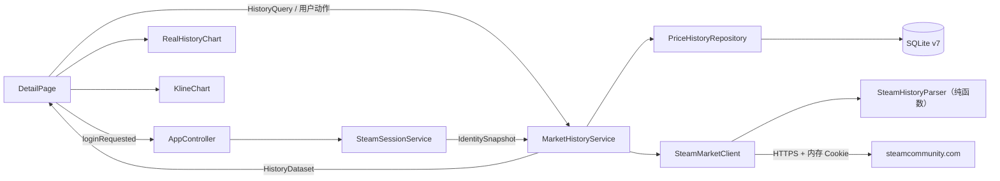
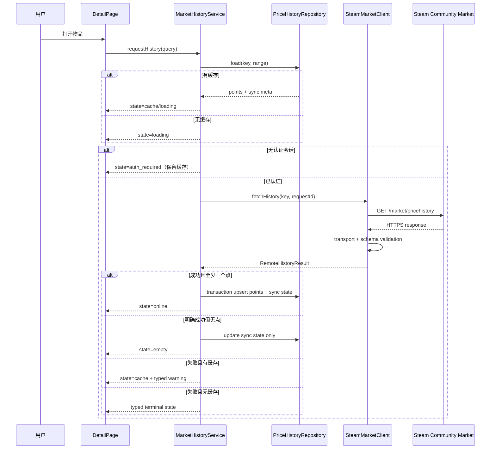
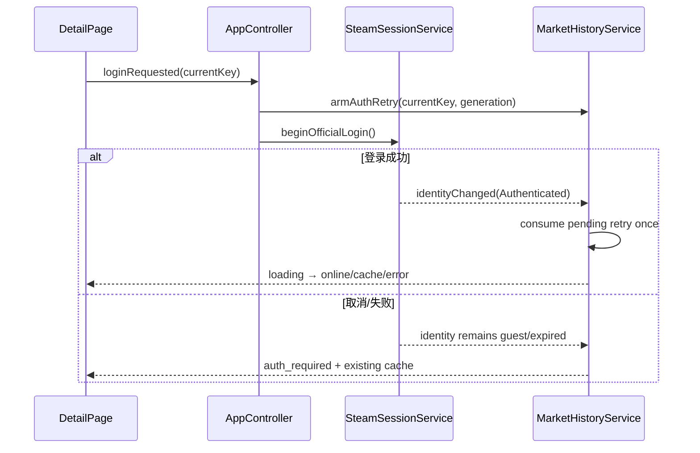

# CR-006 系统架构：真实市场历史与走势图

> 输入：已批准的 `PRD-CR-006-real-market-trends.md` 与 US-45～US-51。本文是 CR-006 G2 的增量架构基线；与既有 `architecture.md` 冲突时，以本文为本变更范围内的事实来源。

## 1. 需求复核与约束

- 平台保持 Windows 10/11、Qt 6.11 Widgets/Charts、C++、SQLite、qmake；不引入服务端；
- 真实历史只由用户打开单品或点击刷新触发，不做后台全市场扫描；
- Steam 登录由现有 `SteamSessionService + WebView2SessionHost` 提供，历史模块不得接收密码或持久化 Cookie；
- Steam Community Market 单品页面提供历史价格图，但网页内部端点没有面向普通桌面客户端的稳定契约；实现必须缓存优先、严格校验和可降级；
- 历史点不是逐笔成交；24h 和日 K 均是对 Steam 历史点的筛选/聚合。

## 2. 方案比较

| 方案 | 优点 | 缺点 | 结论 |
| --- | --- | --- | --- |
| A. 继续扩展 `MarketService::detailReady(QVector, QString)` | 改动最少 | 无法稳定表达在线/缓存/空/认证/限流；详情概览与历史强耦合；难测试登录恢复 | 不采用 |
| B. 新建类型化 `MarketHistoryService` 深模块 | 明确单一职责；缓存、并发、认证恢复、错误和来源封装；UI 契约稳定 | 新增模型/仓储并迁移旧信号，工作量中等 | **采用** |
| C. 在 WebView 页面执行脚本直接读取图表 | 可能复用网页渲染 | 安全边界大、难测试、依赖 DOM、无法稳定持久化与降级 | 不采用 |

决策详见 `adr/ADR-005-typed-on-demand-market-history.md`。

### 2.1 分层技术取舍

| 层次 | 候选 1 | 候选 2 | 选择与理由 |
| --- | --- | --- | --- |
| UI/图表 | 单 `QChart`：折线 + `QBarSeries` 共轴 | 两个 `QChartView`：价格折线 + 成交量 `QAreaSeries`，同步时间范围 | 选候选 2；Qt 柱系列是分类轴语义，双图才能可靠使用连续时间轴并清晰分离量价 |
| 服务/解析 | 在 `MarketService` 内直接解析并返回向量 | `MarketHistoryService` 编排 + 无 QObject 的纯 Parser | 选候选 2；可表达来源/状态并对 Steam 字段变化做隔离测试 |
| 数据库 | 原表追加 nullable 列与新索引 | v7 重建表移除旧唯一约束 + 新建同步状态表 | 选候选 2；SQLite 无法直接删除旧表级 UNIQUE，追加索引不能修复冲突 |
| 部署/数据源 | 新建云代理或嵌入 Steamworks publisher key | 保持单机、用户主动 Steam 会话、按需社区市场数据 | 选候选 2；无服务端成本，不把受限密钥放客户端，符合既有部署与安全边界 |

Qt Charts、Qt Network、SQLite 和 qmake 均为已批准且已实测的既有栈；CR-006 不重新引入 QML、第三方图表库或外部数据库。

## 3. 逻辑视图



### 3.1 模块职责

| 模块 | 职责 | 禁止事项 |
| --- | --- | --- |
| `SteamMarketClient` | HTTPS、最终 URL/状态/Content-Type、限速、Retry-After、响应字节上限 | 不写数据库、不生成用户文案、不把解析失败当空数据 |
| `SteamHistoryParser` | 纯函数解析 JSON；校验 `success`、数组、时间、价格、成交量；排序/去重 | 不访问网络、数据库或全局币种 |
| `MarketHistoryService` | 缓存优先、请求去重、认证门、一次性登录恢复、状态合并、过期响应抑制 | 不操作 QWidget、不持有 Cookie 值、不自行弹登录框 |
| `PriceHistoryRepository` | 历史点与同步元数据事务写入、区间读取、来源过滤、稳定排序 | 不接受未校验远端 JSON、不生成 fixture |
| `RealHistoryChart` | 价格与成交量同时间轴双子图、周期筛选、悬停、空/单点/断档 | 不发网络请求、不补造点、不推断在线状态 |
| `KlineService` | 对已校验历史点按本地显示日历聚合并计算均线 | 不宣称逐笔 OHLC、不写回原始历史点 |

### 3.2 依赖规则

```text
UI → MarketHistoryService → SteamMarketClient / PriceHistoryRepository
SteamMarketClient → SteamHistoryParser
MarketHistoryService → core/models（HistoryQuery、HistoryDataset、HistoryError）
KlineService → PriceHistoryRepository 或 HistoryPoint[]
```

- UI 不得访问 `QNetworkAccessManager`、CookieJar 或 SQLite；
- Parser 不得依赖 QObject，保证纯单元测试；
- `MarketService` 保留搜索与概览职责，CR-006 将历史职责迁出；
- `DetailPage` 并行消费概览和历史两个独立结果，不再等待合并的 `detailReady` 才显示。

## 4. 核心模型与状态机

### 4.1 查询键

`HistoryKey = (marketHashName, appid, currency)`；`HistoryQuery` 另含 `rangeDays` 与 `forceRefresh`。缓存和网络去重只使用 `HistoryKey`，周期切换不重新请求。

### 4.2 结果状态

| 状态 | 含义 | 是否含点 | UI 主动作 |
| --- | --- | --- | --- |
| `loading` | 已显示缓存或空骨架，正在远端读取 | 可选 | 禁用重复刷新 |
| `online` | 本次用户动作获得并校验成功 | 至少 1 | 可刷新 |
| `cache` | 使用此前有效数据，本次未获在线成功 | 至少 1 | 重试/登录 |
| `empty` | Steam 明确成功但没有有效点 | 0 | 稍后刷新 |
| `auth_required` | 无有效 Steam 会话，不发历史请求 | 可选缓存 | 登录 Steam |
| `rate_limited` | 429 或明确限流 | 可选缓存 | 倒计时后重试 |
| `source_error` | HTTP 拒绝、schema 变化或业务失败 | 可选缓存 | 重试/打开官方页 |
| `offline` | 网络/超时失败 | 可选缓存 | 重试 |

`HistoryDataset` 必须携带 `HistoryProvenance`；错误是类型化 `HistoryErrorCode`，禁止只传 `QString`。

## 5. 关键流程

### 5.1 缓存优先与在线刷新



### 5.2 页内登录恢复



- 同一 `HistoryKey` 同时最多一个远端请求；
- 每次详情切换增加 `generation`，旧响应可入库但不得覆盖当前页面；
- 登录成功自动重试最多一次，之后只能由用户手动重试；
- 周期切换只筛选本地已加载数据。

## 6. 网络与解析边界

- 仅允许 HTTPS 且最终主机为 `steamcommunity.com` 或其受控子域；登录重定向/HTML 不进入 JSON Parser；
- 响应体上限 8 MiB；超限返回 `SOURCE_REJECTED`；
- `429` 不走普通自动重试，解析并钳制 `Retry-After` 为 1 秒～15 分钟；
- 其他瞬时网络错误最多 1 次退避重试；认证、403、业务失败、schema 变化不自动重试；
- 有效历史点：UTC 时间有效、`price > 0`、`volume` 为 null 或 `>= 0`；无效行计数并丢弃；
- 若数组非空但有效行比例低于 95%，整个响应判定为 `SOURCE_SCHEMA_CHANGED`，不部分写库；
- 排序与去重键为 `(recordedAtUtc)`；重复时间保留最后一个合法点并记录去重数。

## 7. 数据与部署视图

数据实体与迁移见：

- `data-model-CR-006-real-market-trends.md`
- `database-design-CR-006-real-market-trends.md`

部署不增加进程、端口或服务端；数据库升级为 schema v7。应用在执行 v7 表重建前生成经 WAL checkpoint 的 `*.pre-v7.bak`，失败即终止启动并保留原库。

## 8. 性能、可观测性与恢复

- 缓存区间查询目标 p95 <50 ms（单物品 50,000 点上限）；
- Parser 在 10,000 点 fixture 上目标 <100 ms，所有网络/解析在 UI 线程外或异步完成；
- 日志只记录：requestId、appid、物品名哈希、币种、HTTP 状态、结果状态、点数、耗时、无效/重复点数；
- 禁止记录 URL 完整查询、Cookie、响应体、SteamID、账户名称；
- 指标：history.request.total、history.request.duration_ms、history.points.valid、history.cache.hit、history.error.code；
- 数据库或迁移失败不删除原库；恢复使用 `.pre-v7.bak` 并执行 `PRAGMA integrity_check`。

## 9. 需求追溯

| 需求 | 设计落点 |
| --- | --- |
| CR6-F1/F4/F5 | Parser、HistoryService、v7 仓储与严格校验 |
| CR6-F2/F8 | HistoryDataset 状态 + provenance + cache-first 流程 |
| CR6-F3 | AppController 编排的一次性登录恢复 |
| CR6-F6/F7 | RealHistoryChart、KlineService 精确语义 |
| CR6-F9 | source_kind + 临时 smoke 数据库隔离 |
| CR6-F10 | 安全设计与真实联网验收契约 |
