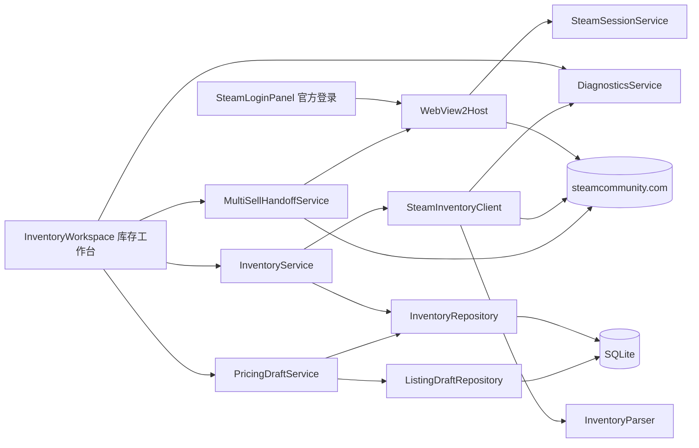
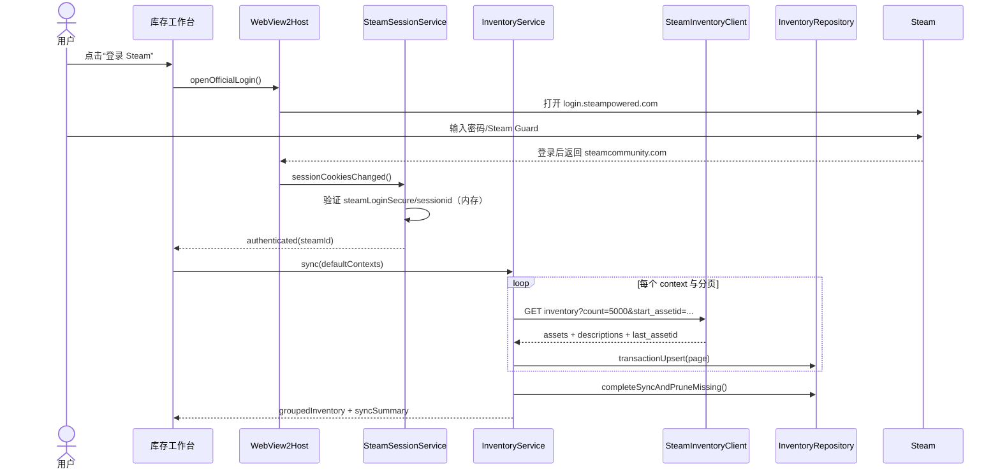
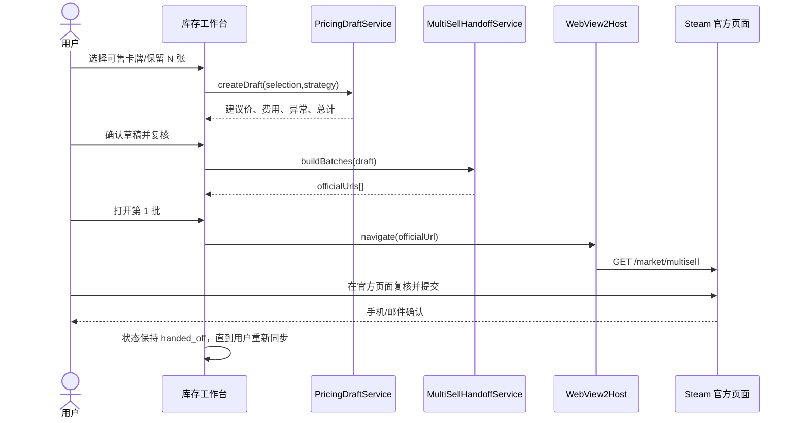
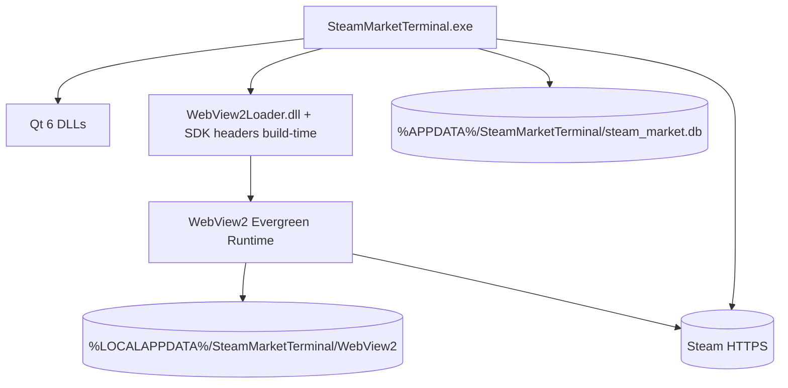

# v4 系统架构设计：库存优先与批量上架助手（CR-003）

## 1. 输入与约束

- 已批准需求：`docs/requirements/PRD-v4-CR-003.md`、`docs/requirements/user-stories-v4-CR-003.md`；
- 运行环境：Windows 10/11、Qt 6.11 Widgets、C++17、MinGW 13.1、SQLite；
- 本机状态：WebView2 Evergreen Runtime 已安装（150.0.4078.105）；Qt WebEngine 模块未安装；
- 合规约束：不生成无人值守交易请求，不自动点击提交或确认；用户在 Steam 官方页面主动提交。

## 2. 技术选型

### 2.1 官方登录容器

| 方案 | 优点 | 缺点 | 结论 |
| --- | --- | --- | --- |
| Qt WebEngine | Qt API 一致、可嵌入 | Qt 6.11 WebEngine 官方不支持 MinGW；本机模块缺失；体积大 | 淘汰 |
| 系统默认浏览器 + Steam OpenID | 实现简单、不接触密码 | OpenID 只证明身份，不提供私密库存/市场会话；无法在应用内复用登录态 | 仅作公开库存降级 |
| Microsoft Edge WebView2 Win32 | Windows 原生、用户直接在 Steam 官方页面登录、会话隔离、可复用官方批量上架页 | 需引入 WebView2 SDK 与 Win32 COM 适配 | 采用 |

实现基线：固定 `Microsoft.Web.WebView2` 稳定 SDK `1.0.4078.44`，运行时采用 Evergreen；通过 `QLibrary` 动态加载 `WebView2Loader.dll`，避免静态绑定运行时。SDK 兼容性在 G3 第一项执行编译冒烟；若 MinGW COM 头兼容失败，降级为独立登录代理进程，不修改上层接口。

### 2.2 UI 与数据层

| 关注点 | 候选 | 结论 |
| --- | --- | --- |
| 库存列表 | QTableWidget / QTableView+Model | QTableView + 自定义模型，支持 1000+ 行与增量更新 |
| 本地缓存 | JSON / SQLite | 延续 SQLite，事务写入与分页查询 |
| 金额 | REAL 元 / INTEGER 最小币种单位 | 新模块统一 INTEGER 分/美分，避免舍入误差 |
| 页面交接 | 内部 `sellitem` POST / 官方 `market/multisell` | 仅官方页面交接；不由原生代码提交交易 |

## 3. 逻辑视图

## 4. 模块边界与依赖

| 模块 | 职责 | 禁止事项 |
| --- | --- | --- |
| `WebView2Host` | 创建浏览器、显示官方域名、导航白名单、登录/官方上架页面 | 不向网页暴露任意原生对象；不注入自动点击脚本 |
| `SteamSessionService` | 会话状态、SteamID 识别、Cookie 内存桥接、登出清理 | 不保存密码；不把 Cookie 写入 SQLite/日志/UI |
| `SteamInventoryClient` | 按 appid/contextid 分页 GET、限速、429 退避、响应大小限制 | 不提交市场交易 POST |
| `InventoryParser` | 纯函数解析 JSON、关联 assets/descriptions、标签归一化 | 不做网络/数据库调用 |
| `InventoryService` | 同步编排、缓存切换、去重、分组、进度 | 不跨过仓储直接写 SQL |
| `PricingDraftService` | 价格策略、费用、保留数量、异常项目、草稿快照 | 不保证建议价等于实际成交价 |
| `MultiSellHandoffService` | 依据 appid/contextid 分批生成官方 URL、打开同一 WebView2 会话 | 不自动提交、确认或标记“已上架” |
| `DiagnosticsService` | 错误分类、重试建议、状态事件 | 不显示原始响应/Cookie |

依赖方向：`UI → Service → Client/Repository → Qt Network/SQLite`。WebView2 通过 `IWebSessionHost` 接口注入，业务服务不依赖 Win32 具体类型。

## 5. 关键数据流

### 5.1 官方登录与库存同步

### 5.2 批量定价与官方页面交接

## 6. 库存上下文

| appid | contextid | 名称 | 默认同步 |
| --- | --- | --- | --- |
| 753 | 6 | Steam 社区物品（卡牌、闪卡、表情、背景） | 是 |
| 730 | 2 | Counter-Strike 2 | 是 |
| 570 | 2 | Dota 2 | 是 |
| 440 | 2 | Team Fortress 2 | 否（设置中启用） |

上下文来自配置，不散落硬编码。资产主键为 `(steam_id, appid, contextid, assetid)`；描述键为 `(appid, classid, instanceid)`。

## 7. 分页、限流与一致性

- 每上下文串行请求；默认间隔 2000ms；最大 5000 项/页；响应上限 16MB；
- `more_items=true` 时必须带上一次 `last_assetid`；游标不前进则终止并报 `INVENTORY_CURSOR_STALLED`；
- 429 立即暂停当前同步，优先尊重 `Retry-After`，否则指数退避 30/60/120 秒，不自动无限重试；
- 同步使用 `sync_id`：页面落库后标记 `last_seen_sync_id`；只有完整成功时才清理本上下文未见资产；失败时保留旧缓存；
- UI 永远展示 `synced_at/stale`；上架交接前强制检查草稿对应资产未过期，超过 5 分钟要求重新同步。

## 8. 批量规则

- 同一批次必须具有相同 `appid/contextid`；
- URL 使用重复的 `items[]` 参数和 URL 编码后的 `market_hash_name`；
- 单批最多 40 个物品组且编码后 URL 不超过 1800 字节；超出自动拆批；
- 仅 `marketable=true` 且无 `marketable_after` 阻塞的组进入草稿；
- 金额以钱包最小币种单位存储，输出前再格式化；
- 价格策略只产生建议，不写回 Steam 页面、不自动提交；不支持的物品降级打开单品官方市场页。

## 9. 部署视图

启动时检查 Runtime；缺失时显示官方安装入口并允许“公开库存只读模式”。打包加入 `WebView2Loader.dll`，不捆绑固定版 Chromium。

## 10. 可观测性

- 事件：`session_state_changed`、`inventory_sync_started/completed/failed`、`draft_created`、`handoff_opened`；
- 指标：分页数、资产数、解析丢弃数、缓存命中、429 次数、同步耗时；
- 脱敏：SteamID 日志仅保留末 4 位；物品名允许记录；Cookie、URL 查询串和响应正文禁止记录；
- 关联 ID：每次同步和草稿使用 UUID，错误中心只展示短 ID。

## 11. 需求追溯

| 需求 | 架构落实 |
| --- | --- |
| US-24 | WebView2Host + SteamSessionService + 自动同步 |
| US-25 | 上下文配置 + InventoryParser + sync_id 分页一致性 |
| US-26 | PricingDraftService + 最小币种单位 |
| US-27 | MultiSellHandoffService + 官方页面用户提交 |
| US-28 | DiagnosticsService + 结构化错误/重试 |
| US-29 | InventoryWorkspace + QTableView model |
