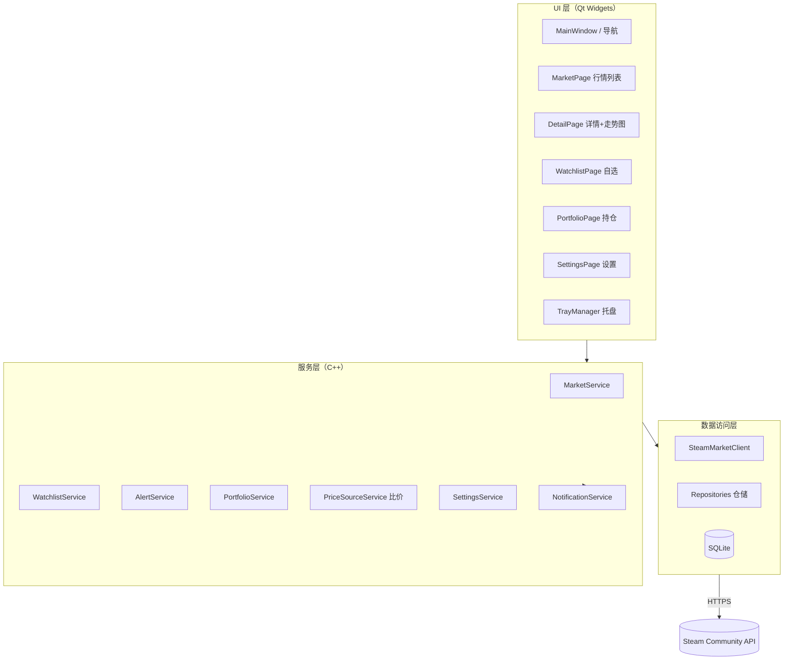
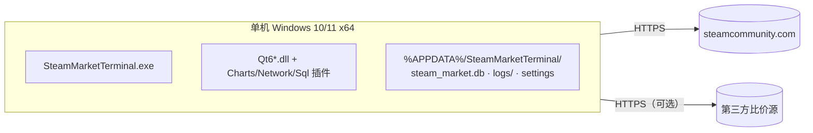
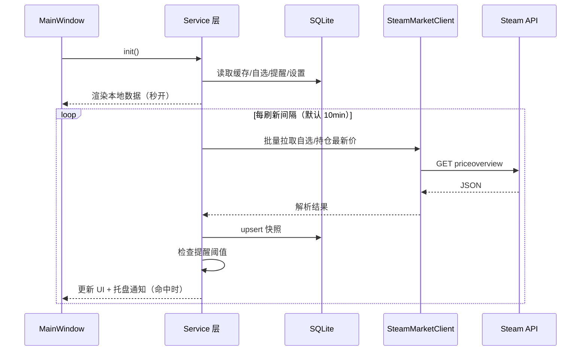
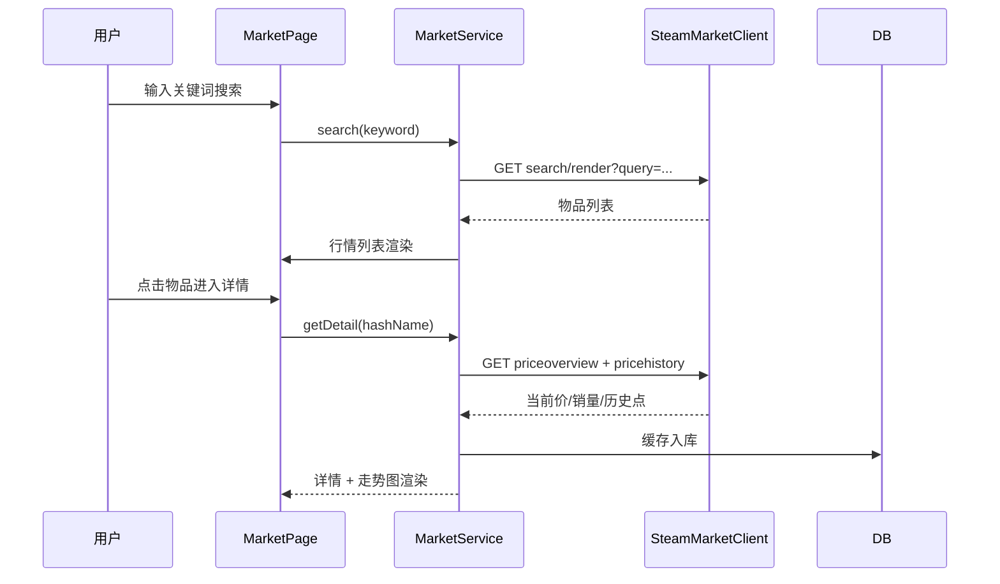
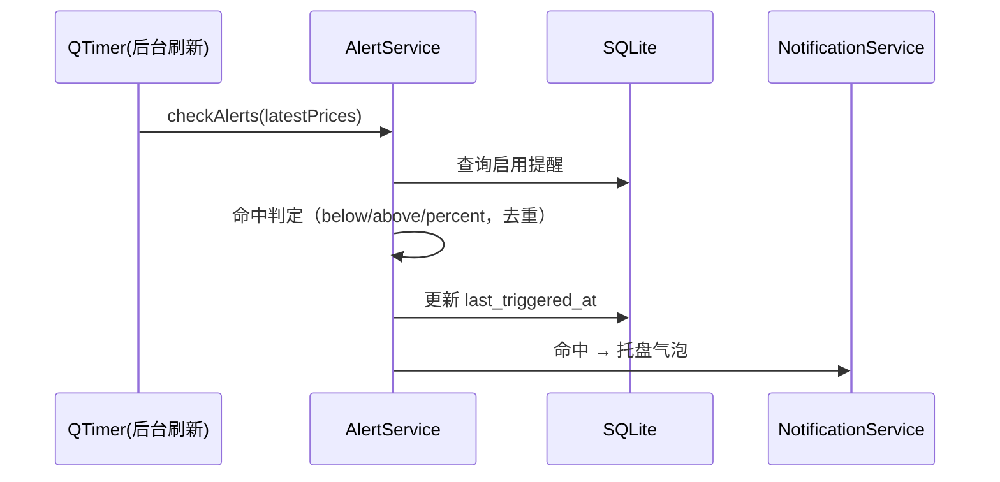
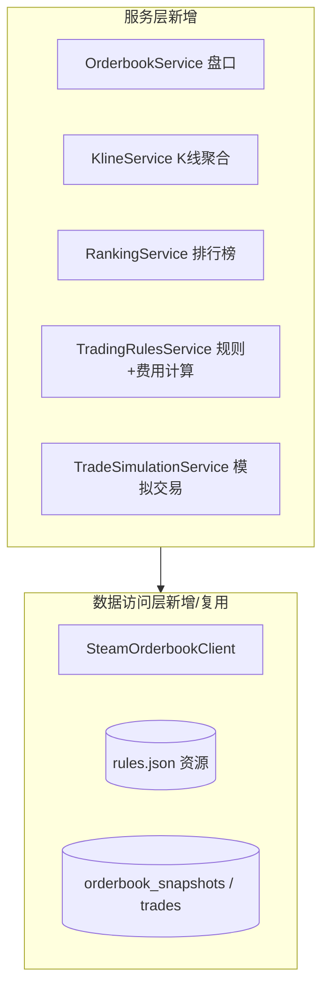
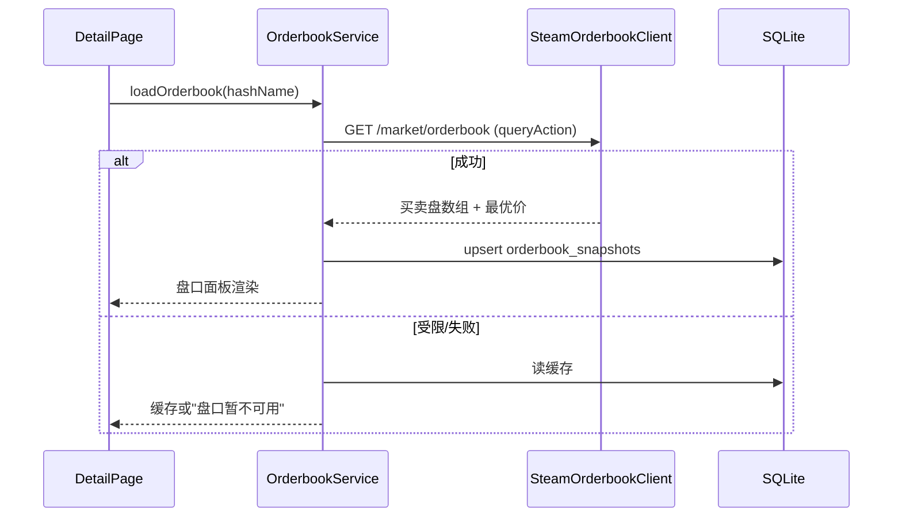
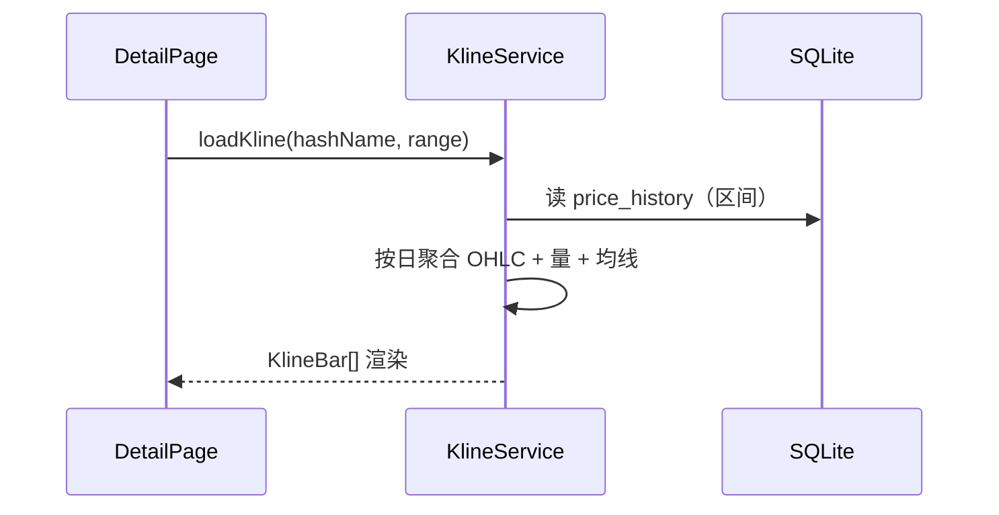
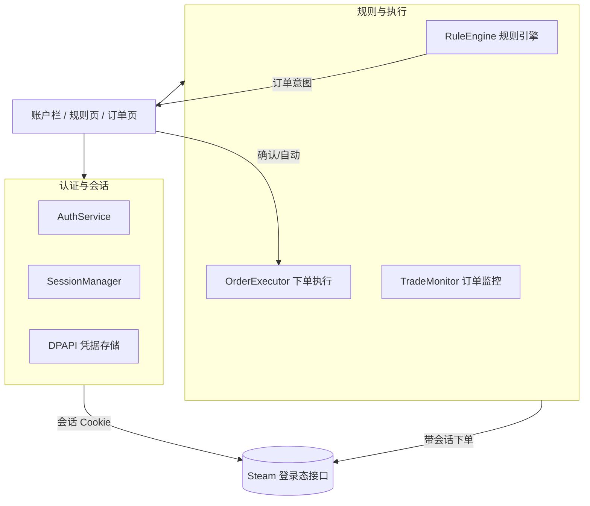

# 系统架构设计

> 阶段 2 设计交付物（与阶段 1 合并门禁）。基于已批准需求（PRD v1.0 + v2/CR-001）。

## 1. 技术选型

| 关注点 | 选型 | 主要备选 | 结论理由 |
| --- | --- | --- | --- |
| UI 框架 | Qt Widgets（Qt 6.11 + MinGW 64） | Qt Quick/QML | 行情软件以表格/列表/图表为主，Widgets 模型视图成熟、定制成本低；本机工具链现成 |
| 图表 | Qt Charts（`QT += charts`） | QCustomPlot / QPainter 自绘 | 官方模块 API 简洁；若发行包未含 Charts 则回退 QCustomPlot（见 R-005） |
| 本地数据库 | SQLite（Qt SQL 驱动） | JSON 文件 | 查询/索引/事务能力强，单文件易备份，零部署 |
| 网络 | Qt Network（QNetworkAccessManager） | libcurl | 官方异步 API，与事件循环天然集成 |
| 构建 | qmake（备选 CMake） | — | 本机 Qt 6.11 + MinGW 已配置 qmake 工作流 |
| 通知 | QSystemTrayIcon + 气泡消息 | QMessageBox | 后台驻留场景必需 |
| 配置 | QSettings（注册表/INI） | 自研 KV | 系统标准机制，设置类数据轻量 |

技术选型决策详见 [adr/ADR-001-qt-desktop-architecture.md](adr/ADR-001-qt-desktop-architecture.md) 与 [adr/ADR-002-local-sqlite-and-data-sources.md](adr/ADR-002-local-sqlite-and-data-sources.md)。

## 2. 逻辑视图（模块与职责）



**依赖规则**：UI → 服务 → 数据访问；禁止跨层调用（UI 不得直连网络/数据库）；服务层不依赖 UI 类型；DTO 统一放 `models` 共享。

## 3. 数据视图

实体关系见 [data-model.md](data-model.md)：`items`、`price_snapshots`、`price_history`、`watchlist`、`alerts`、`portfolio_items`、`platform_prices`、`settings`。

## 4. 部署视图



- 安装目录：应用 + Qt 运行库（windeployqt 打包）；
- 数据目录：`QStandardPaths::AppDataLocation`（`%APPDATA%/SteamMarketTerminal/`），含数据库、日志、配置；
- 无外部数据库/服务器依赖。

## 5. 关键流程时序

### 5.1 启动与后台刷新



### 5.2 搜索与详情



### 5.3 提醒触发



## 6. 模块与边界

```text
src/
  app/            # main.cpp、Application 装配
  ui/             # 主窗口、各页面、托盘、自定义控件
  services/       # Market/Watchlist/Alert/Portfolio/PriceSource/Settings/Notification
  data/           # 仓储、SQLite 连接、schema 迁移脚本
  network/        # SteamMarketClient、响应解析、限流/重试
  models/         # DTO/实体（与 API 契约、数据模型一致）
  common/         # 错误码、日志、工具
  tests/          # 单元测试（Qt Test）
docs/             # 本项目文档
```

**接口边界**：服务层方法签名对应 [api-contract.yaml](api-contract.yaml) 的契约；`IPriceSource` 为比价数据源抽象，注册式扩展。

## 7. 横切关注点

- **日志**：`QLoggingCategory` 分模块；文件日志滚动（默认 5MB×3）；不记录完整查询参数中的敏感字段；
- **错误处理**：统一 `Error{code, userMessage}`；网络/解析/数据库错误各有类别，UI 只展示用户可读信息；
- **性能**：QTableView + 模型视图渲染大数据量；网络异步不阻塞 UI；批量写入走事务；
- **限流**：对 Steam 接口设置最小间隔（默认 ≥1.5s/请求）与并发上限，降低触发限流概率；
- **可观测**：记录启动耗时、每次刷新耗时与失败率到日志。

---

# v2 架构更新（CR-001）

## V2-1 新增模块



- **盘口**：`SteamMarketClient` 调 Steam 新版 `/market/orderbook?q=Load&qp=[appid,market_hash_name]`，附带 `x-valve-request-type: queryAction`，解析紧凑买卖档位、最优价格及响应币种；与现有限速器共用串行队列；
- **K线**：`KlineService` 从 `price_history` 聚合日 OHLC + 成交量（按 UTC 日），均线在内存计算，不落库；
- **排行榜**：`RankingService` 基于本地快照/历史计算成交量榜、涨幅榜（对比 24h 前快照）、跌幅榜；
- **规则库**：`rules.json` 内嵌资源（QRC），`TradingRulesService` 提供分类查询；费率默认 CS2 5%+10%，存 settings 可调；
- **模拟交易**：`TradeSimulationService` 写入 `trades` 表，买入/卖出自动计费并联动持仓估值。

## V2-2 关键流程

### 盘口加载



### 日 K 聚合



---

# v3 架构更新（CR-002）

## V3-1 已实施（多游戏 + 会话就绪）

- 游戏维度贯穿数据层：`appid` 入参（730/570/440），`price_history/price_snapshots` 唯一约束含 appid（迁移 0003）；
- 界面：行情页游戏选择器（TF2 禁用）、设置默认游戏、字号/对比度提升；
- 历史解析：`parseHistoryDate` 显式英文区域 + 多格式回退，修复中文系统下历史为空的问题。

## V3-2 自动化交易模块（待批准实施）



- **认证**：`AuthService` 走 Steam 官方登录流程（用户名/密码/Steam Guard），成功后 Cookie 用 Windows DPAPI（CryptProtectData）加密存本地；会话供 `pricehistory`、`itemordershistogram`、下单接口复用；
- **规则引擎**：规则模板 + 周期扫描快照 → 条件匹配 → 订单意图（意图默认人工确认，可全局切自动）；
- **执行器**：带会话调用 Steam 市场挂单/求购接口（需 sessionid + CSRF 校验），幂等防重（同物品+价格+方向冷却窗口）、余额/限额校验；
- **风控**：单日支出上限、最大持仓、冷却、紧急停止、审计日志（不含凭据）。

## V3-3 关键时序（自动化交易）

```mermaid
sequenceDiagram
    participant T as QTimer(周期)
    participant RE as RuleEngine
    participant DB as SQLite
    participant OE as OrderExecutor
    participant ST as Steam API
    T->>RE: scan()
    RE->>DB: 读取启用规则+最新快照
    RE->>RE: 条件匹配+风控（限额/冷却/去重）
    RE-->>UI: 订单意图（待确认）
    alt 人工确认
        UI-->>OE: 用户确认
    else 自动执行
        OE: 自动触发
    end
    OE->>ST: 挂单/求购（带会话）
    ST-->>OE: 订单结果
    OE->>DB: 写 orders 记录
```
