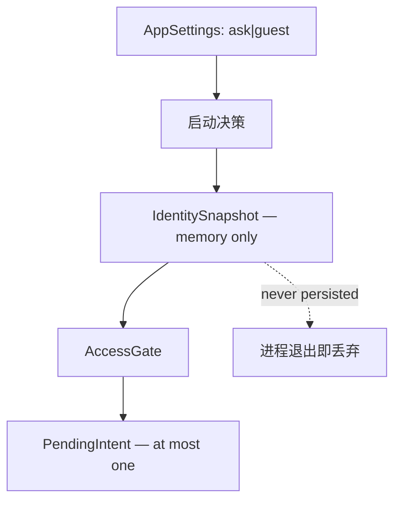

# CR-004 账户入口数据模型（G2）

## 1. 边界

CR-004 不创建本地账户实体，不把 Steam 用户映射成本地用户，也不持久化认证会话。数据分为“可持久化启动偏好”和“仅运行时身份上下文”两类。

## 2. 持久化设置

在现有 `AppSettings` JSON 中新增：

```json
{
  "startupIdentityMode": "ask"
}
```

取值：

- `ask`：每次启动展示账户入口，默认值；
- `guest`：启动直接进入游客模式，并提供可撤销提示。

序列化规则：

1. 缺失、空值、大小写错误或未知枚举一律回退 `ask`；
2. 写入时只输出规范小写值；
3. 不新增 `authenticated`、`lastLoginSucceeded`、`cookie`、`sessionToken` 等字段；
4. 设置写入失败不阻断启动，退回 `ask` 并给出非敏感诊断。

## 3. 运行时模型

### IdentitySnapshot

| 字段 | 类型 | 持久化 | 约束 |
|---|---|---:|---|
| state | IdentityState | 否 | 显式状态枚举 |
| steamId64 | QString | 否 | 仅 PublicInventory / Authenticated 非空 |
| displayName | QString | 否 | UI 展示值，不作为权限依据 |
| statusMessage | QString | 否 | 不含远端正文与凭据 |
| busy | bool | 否 | 只描述当前命令执行中 |

### PendingIntent

| 字段 | 类型 | 持久化 | 约束 |
|---|---|---:|---|
| target | IntentTarget | 否 | Inventory / AccountAction |
| actionId | QString | 否 | 白名单稳定标识，不含参数 |
| generation | quint64 | 否 | 防止旧回调重放 |

`PendingIntent` 最大一条；应用退出、注销、登录取消或失败后清除。

### WebSessionCapability

`Unknown / Available / Unavailable`，仅运行时存在。它描述 WebView2 能力，不参与身份持久化。

## 4. 与既有模型关系

- 现有关注列表、市场缓存和公开库存缓存不因身份切换删除；
- CR-003 的 `steam_accounts.session_state` 若已存在，只可作为历史/展示缓存，不得在启动时据此恢复 `Authenticated`；
- 当前权限只由 `IdentitySnapshot.state` 判定；
- SteamID 可以用于公开库存查询，但不得反推为已认证账户；
- 注销清理当前身份和 Cookie，不删除用户本地关注列表。

## 5. 生命周期



## 6. 数据质量与验证

- SteamID64 沿用现有规范化与长度校验；
- 显示名按纯文本渲染，最大长度由 UI 截断，不作为查询键；
- 状态与字段组合由构造器校验，例如 `Authenticated + empty steamId64` 非法；
- 反序列化设置采取 fail-closed：不认识就回到 `ask`。

## 7. 隐私

本变更新增持久化数据只有一个非敏感枚举。不得增加登录时间线、浏览历史、账户画像或 Cookie 指纹。诊断事件中的 SteamID 采用既有脱敏策略，不输出完整值。
