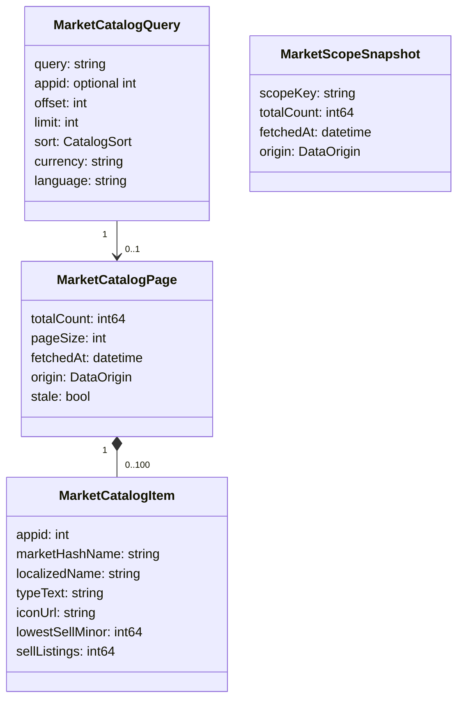

# CR-005 Steam 全市场目录数据模型（G2）

## 1. 聚合

Steam 当前实测一页为 10 条；模型允许服务端未来调整 pagesize，但客户端不按请求 limit 预分配。

## 2. 字段语义

- `totalCount`：Steam 对当前查询条件返回的可检索结果数，不是 listing 总数、资产数或成交量；
- `sellListings`：某结果当前在售挂单数量；
- `lowestSellMinor`：当前最低挂单价，整数最小币种单位；
- `origin`：`SteamLive` 或 `SteamCached`，所有页面和范围快照必填；
- `stale`：缓存超过 TTL 仍因离线/限流展示；
- `scopeKey`：`all` 或 `appid:<id>`；
- `marketHashName` 与 `appid` 共同构成远端物品身份，G3 迁移前检查旧单列主键冲突。

## 3. 值对象与不变量

`MoneyMinor(currency, value)`：currency 必须在配置白名单，value ≥0。不得从 `sale_price_text` 反向猜测计算币种。

`DataFreshness(origin, fetchedAt, stale)`：`SteamLive` 不可 stale；`SteamCached` 必须显示 fetchedAt。

`CatalogRange(offset, pageSize, totalCount)`：offset≥0、1≤pageSize≤100、totalCount≥0、items.size≤pageSize；offset≥totalCount 时仅允许空页或 `PAGE_OUT_OF_RANGE`。

## 4. 持久化边界

持久化：查询页必要字段、规范化查询、范围总数快照、TTL；已访问物品可 upsert 到 items。

不持久化：HTML 片段、Cookie、完整响应正文、publisher key、用户密码、验证码、登录页内容。

## 5. UI 派生数据

可以直接派生：页码范围、热门物品、重点游戏 total_count、最低挂单价、挂单量、缓存年龄。

不可直接派生：全市场 24h 涨跌、全市场成交额、唯一卖家数、全市场价格指数。此类字段若以后新增，必须标注算法、覆盖率与采样来源，不复用 `totalCount` 或 `sellListings` 伪造。

## 6. 一致性

- 页面与范围快照来自同次响应时共享 fetchedAt；
- 多个 appid 的计数不是原子快照，UI 显示每卡时间或统一标注“分批查询”；
- 远端市场不断变化，分页期间项目可能移动/增删，客户端不承诺跨页原子一致；
- 缓存更新以查询哈希和 offset 为单位事务写入。
