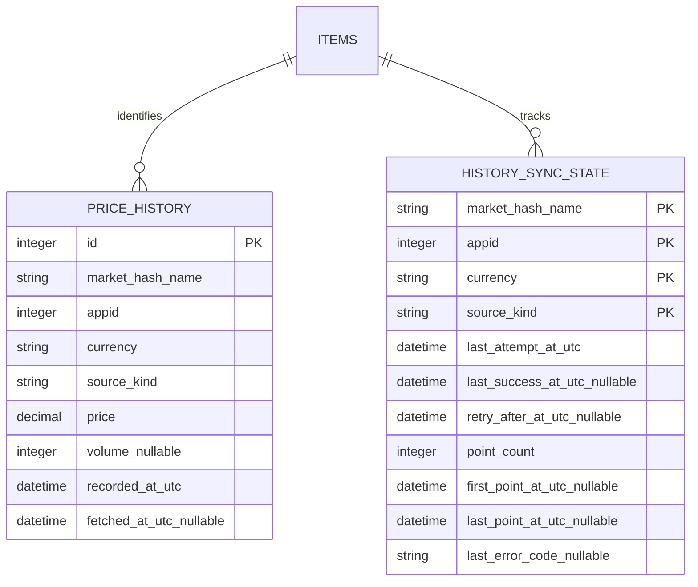

# CR-006 数据模型：真实市场历史

> 本文冻结 CR-006 的逻辑实体和字段语义。物理表与迁移见 `database-design-CR-006-real-market-trends.md`。

## 1. 实体关系



## 2. `HistoryKey`

| 字段 | 类型 | 约束 | 语义 |
| --- | --- | --- | --- |
| `marketHashName` | string | 1～256；原样匹配 | Steam 市场哈希名称 |
| `appid` | integer | `>0` | 游戏/应用维度 |
| `currency` | enum | CNY/USD/EUR/RUB | Steam 请求和显示币种 |

`HistoryKey` 是查询、缓存、并发去重和同步状态的业务键。图表周期不属于该键。

## 3. `HistoryPoint`

| 字段 | 类型 | 约束 | 语义 |
| --- | --- | --- | --- |
| `recordedAtUtc` | datetime | 有效 UTC ISO-8601 | Steam 历史点对应时间 |
| `price` | double | 有限数且 `>0` | 该点价格，币种由 `HistoryKey.currency` 决定 |
| `volume` | nullable int | null 或 `>=0` | Steam 返回的该点数量；缺失与 0 不等价 |

不在点模型中存放展示格式、涨跌颜色或本地时区。排序键固定为 `recordedAtUtc ASC`。

## 4. `HistoryProvenance`

| 字段 | 类型 | 说明 |
| --- | --- | --- |
| `provider` | enum | `steam_community_market` / `legacy_local` / `test_fixture` |
| `sourceKind` | enum | `steam_history` / `legacy_unknown` / `smoke_fixture` |
| `retrievedAtUtc` | nullable datetime | 此数据集最近成功获取时间；旧来源未知数据为 null |
| `lastAttemptAtUtc` | nullable datetime | 最近一次联网尝试时间 |
| `firstPointAtUtc` / `lastPointAtUtc` | nullable datetime | 数据覆盖范围 |
| `pointCount` | int | 当前返回数据集点数 |
| `stale` | bool | 是否不是本次成功在线响应 |
| `authMode` | enum | `user_session` / `none` / `test_fixture` |

约束：只有 `sourceKind=steam_history` 且本次响应成功时才能显示 `state=online`；`legacy_unknown` 永远只能显示缓存/来源未知。

## 5. `HistoryDataset`

```text
HistoryDataset
  key: HistoryKey
  state: online | cache | empty
  points: HistoryPoint[0..50000]
  provenance: HistoryProvenance
  quality: HistoryQuality
  warning?: HistoryError
```

- `online`：至少 1 点，本次 Steam 响应已校验并写库；
- `cache`：至少 1 点，来源可能是此前 Steam 数据或 `legacy_unknown`；
- `empty`：0 点，Steam 本次明确成功且数组为空；
- 加载、认证、限流和不可用属于服务状态/错误，不伪装成数据集状态；
- `warning` 只在缓存可用但本次在线刷新失败时存在。

## 6. 数据质量

`HistoryQuality` 包含：

- `invalidRows`：远端行结构/时间/价格/数量不合法的数量；
- `duplicateRows`：同一响应中重复时间数量；
- `gapCount`：相邻点间隔超过该数据集 p50 间隔的 4 倍且超过 6 小时的区段数；
- `sparse`：选定周期内少于 2 点，或 `gapCount > 0`。

质量字段只用于解释和测试，不修改原始有效点，不生成填补点。

## 7. 日 K 派生模型

`KlineBar(date, open, high, low, close, volume, sampleCount, sparse, ma5, ma10, ma20)`：

- 以用户本地日历日显示；底层历史时间仍为 UTC；
- open/close 取该日第一/最后有效点，high/low 取极值；
- volume 对非 null 点求和；若当日全部为 null，则 volume 仍为 null；
- `sampleCount < 2` 时 `sparse=true`；
- 该模型不落库，文案固定为“按 Steam 历史点本地聚合”。

## 8. 不变量

1. 普通数据库不得写入 `smoke_fixture`；该来源仅允许数据库路径位于 `QDir::tempPath()/smt_smoke_*`；
2. `steam_history` 点必须有 `fetchedAtUtc`；`legacy_unknown` 的 `fetchedAtUtc` 必须为 null；
3. 同 `(marketHashName, appid, currency, sourceKind, recordedAtUtc)` 唯一；
4. 原始响应、Cookie、SteamID、账户名和完整请求 URL不属于数据模型；
5. 旧表迁移的数据统一为 `legacy_unknown`，不得根据猜测改标为 Steam 在线数据。

