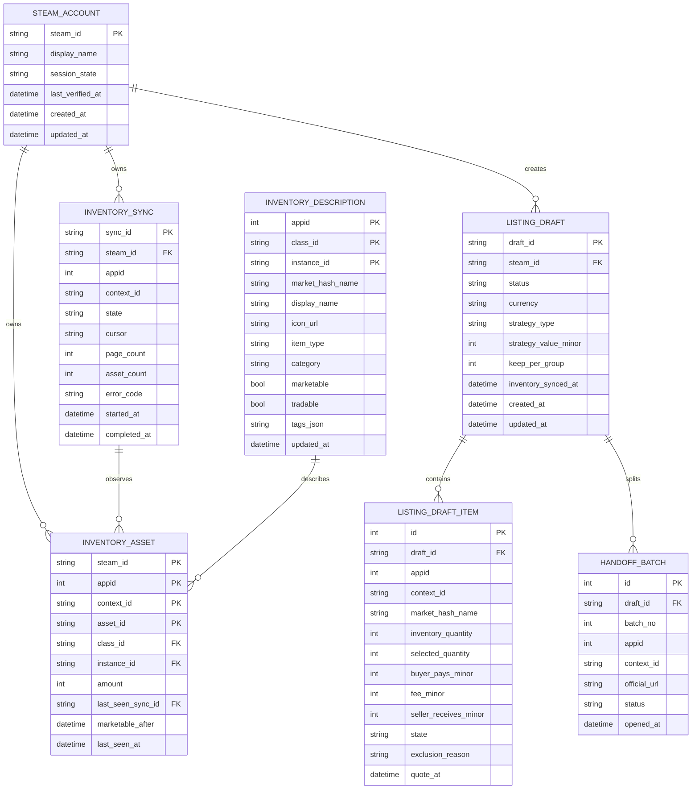

# v4 逻辑数据模型（CR-003）

## 1. ERD

## 2. 聚合模型

### SteamAccount

- 身份信息，不保存密码、Cookie、Steam Guard 或恢复码；
- `session_state`: `anonymous | authenticated | expired | unavailable`；
- WebView2 Cookie 存在专属 UDF，不属于 SQLite 模型。

### InventoryAsset

- 唯一键：`steam_id + appid + context_id + asset_id`；
- `asset_id` 可能在交易后改变，不可跨同步永久引用；
- 只有完整同步成功后才能删除该上下文未见资产。

### InventoryDescription

- 唯一键：`appid + class_id + instance_id`；
- `market_hash_name` 用于行情/官方市场 URL；`display_name` 仅展示；
- `category` 归一化为 `trading_card | foil_card | emoticon | profile_background | game_item | unknown`；
- 原始标签序列化为 JSON，业务筛选只使用白名单归一化字段。

### InventoryGroup（只读 DTO，不落表）

按 `steam_id + appid + context_id + market_hash_name + category` 聚合：

- `assetIds[]`、`quantity`、`marketableQuantity`、`blockedQuantity`；
- `marketable`、`tradable`、`marketableAfter`；
- 图标、类型、普通/闪卡标记；
- 最近同步时间与 `stale`。

### ListingDraft

- 状态：`draft | quoting | ready | handed_off | stale | abandoned`；
- 不使用 `submitted/success`，因为应用不提交交易；
- `inventory_synced_at` 用于 5 分钟新鲜度检查；
- 一个草稿可按 appid/contextid 与 URL 长度拆为多个 HandoffBatch。

### ListingDraftItem

- 金额全部为最小币种单位 INTEGER；
- 状态：`included | excluded | quote_failed | stale`；
- `selected_quantity <= inventory_quantity - keep_per_group`；
- `exclusion_reason`: `NOT_MARKETABLE | TRADE_HOLD | NO_QUOTE | BELOW_MIN_RECEIVE | UNSUPPORTED_MULTI_SELL | STALE_INVENTORY`。

## 3. API 字段映射

| OpenAPI Schema | 数据来源 |
| --- | --- |
| `SessionStatus` | `steam_accounts` + WebView2 runtime state |
| `InventorySync` | `inventory_syncs` |
| `InventoryAsset` | `inventory_assets` + `inventory_descriptions` |
| `InventoryGroup` | 资产/描述聚合查询 |
| `ListingDraft` | `listing_drafts` + `listing_draft_items` |
| `HandoffBatch` | `handoff_batches` |

## 4. 生命周期

- 成功库存缓存：保留 30 天；超过 7 天未见资产可在维护任务中删除；
- 同步记录：保留最近 100 次/账户，失败记录至少保留 30 天；
- 草稿：保留 30 天；`handed_off` 草稿保留 90 天用于审计；
- 描述缓存：最后引用消失 90 天后可清理；
- 旧 `sessions/trading_rules/orders`：v4 只读保留，不迁移敏感 Cookie，不自动删除。
