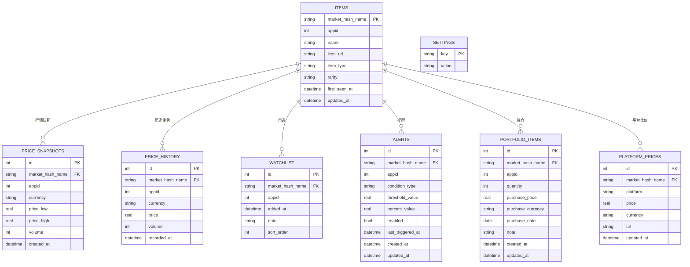

# 数据模型

> 与 api-contract.yaml 字段一致；物理实现见 database-design.md。v2 新增表见第 3 节。

## 1. ERD

## 2. 字段级 Schema

### items（物品）

| 字段 | 类型 | 约束 | 说明 |
| --- | --- | --- | --- |
| market_hash_name | TEXT | PK | Steam 市场物品唯一标识（URL 编码前的名称） |
| appid | INTEGER | NOT NULL | 应用 ID，默认 730（CS2） |
| name | TEXT | NOT NULL | 展示名称 |
| icon_url | TEXT | NULL | 图标地址（Steam CDN） |
| item_type | TEXT | NULL | 类型（武器/皮肤/收藏品等），预留 |
| rarity | TEXT | NULL | 稀有度，预留 |
| first_seen_at | DATETIME | NOT NULL | 首次入库时间 |
| updated_at | DATETIME | NOT NULL | 最近更新时间 |

### price_snapshots（行情快照）

| 字段 | 类型 | 约束 | 说明 |
| --- | --- | --- | --- |
| id | INTEGER | PK AUTOINCREMENT | |
| market_hash_name | TEXT | FK→items, NOT NULL | |
| appid | INTEGER | NOT NULL | |
| currency | TEXT | NOT NULL | 币种（CNY 等） |
| price_low | REAL | NULL | 最低求购价 |
| price_high | REAL | NULL | 最低出售价 |
| volume | INTEGER | NULL | 24h 销量 |
| created_at | DATETIME | NOT NULL | 快照时间 |

唯一约束：`(market_hash_name, currency, created_at)`。

### price_history（历史走势）

| 字段 | 类型 | 约束 | 说明 |
| --- | --- | --- | --- |
| id | INTEGER | PK AUTOINCREMENT | |
| market_hash_name | TEXT | FK→items, NOT NULL | |
| appid | INTEGER | NOT NULL | |
| currency | TEXT | NOT NULL | |
| price | REAL | NOT NULL | 当日价格 |
| volume | INTEGER | NULL | 当日销量 |
| recorded_at | DATETIME | NOT NULL | 记录时间 |

唯一约束：`(market_hash_name, currency, recorded_at)`。

### watchlist（自选）

| 字段 | 类型 | 约束 | 说明 |
| --- | --- | --- | --- |
| id | INTEGER | PK AUTOINCREMENT | |
| market_hash_name | TEXT | FK→items, NOT NULL, UNIQUE | |
| appid | INTEGER | NOT NULL | |
| added_at | DATETIME | NOT NULL | |
| note | TEXT | NULL | 备注（≤200 字） |
| sort_order | INTEGER | NOT NULL DEFAULT 0 | 排序 |

### alerts（提醒）

| 字段 | 类型 | 约束 | 说明 |
| --- | --- | --- | --- |
| id | INTEGER | PK AUTOINCREMENT | |
| market_hash_name | TEXT | FK→items, NOT NULL | |
| appid | INTEGER | NOT NULL | |
| condition_type | TEXT | NOT NULL, CHECK in (below/above/percent_24h) | |
| threshold_value | REAL | NULL | below/above 阈值（>0） |
| percent_value | REAL | NULL | percent_24h 阈值（>0） |
| enabled | INTEGER | NOT NULL DEFAULT 1 | 0/1 |
| last_triggered_at | DATETIME | NULL | 上次触发（去重依据） |
| created_at | DATETIME | NOT NULL | |
| updated_at | DATETIME | NOT NULL | |

### portfolio_items（持仓）

| 字段 | 类型 | 约束 | 说明 |
| --- | --- | --- | --- |
| id | INTEGER | PK AUTOINCREMENT | |
| market_hash_name | TEXT | FK→items, NOT NULL | |
| appid | INTEGER | NOT NULL | |
| quantity | INTEGER | NOT NULL CHECK(quantity>=1) | |
| purchase_price | REAL | NULL | 成本单价 |
| purchase_currency | TEXT | NOT NULL DEFAULT 'CNY' | |
| purchase_date | TEXT | NULL | ISO 日期 |
| note | TEXT | NULL | 备注 |
| created_at | DATETIME | NOT NULL | |
| updated_at | DATETIME | NOT NULL | |

### platform_prices（平台比价）

| 字段 | 类型 | 约束 | 说明 |
| --- | --- | --- | --- |
| id | INTEGER | PK AUTOINCREMENT | |
| market_hash_name | TEXT | FK→items, NOT NULL | |
| platform | TEXT | NOT NULL, CHECK in (steam/buff/c5/youpin/csv) | |
| price | REAL | NULL | 平台价 |
| currency | TEXT | NOT NULL | |
| url | TEXT | NULL | 平台链接 |
| updated_at | DATETIME | NOT NULL | |

唯一约束：`(market_hash_name, platform)`。

### settings（设置）

| 字段 | 类型 | 约束 | 说明 |
| --- | --- | --- | --- |
| key | TEXT | PK | 设置键（currency/refreshIntervalMinutes/...） |
| value | TEXT | NOT NULL | JSON 编码的值 |

## 3. v2 新增表（CR-001）

### orderbook_snapshots（盘口快照，每物品保留最新一份）

| 字段 | 类型 | 约束 | 说明 |
| --- | --- | --- | --- |
| market_hash_name | TEXT | PK, FK→items | |
| buy_orders_json | TEXT | NULL | 买盘数组 JSON（价格,数量） |
| sell_orders_json | TEXT | NULL | 卖盘数组 JSON |
| highest_buy | REAL | NULL | 最高买价 |
| lowest_sell | REAL | NULL | 最低卖价 |
| fetched_at | DATETIME | NOT NULL | 获取时间 |

### trades（模拟交易）

| 字段 | 类型 | 约束 | 说明 |
| --- | --- | --- | --- |
| id | INTEGER | PK AUTOINCREMENT | |
| market_hash_name | TEXT | FK→items, NOT NULL | |
| appid | INTEGER | NOT NULL | |
| side | TEXT | NOT NULL CHECK(side in ('buy','sell')) | |
| quantity | INTEGER | NOT NULL CHECK(quantity>=1) | |
| price | REAL | NOT NULL | 单价 |
| fee | REAL | NOT NULL DEFAULT 0 | 手续费合计 |
| total | REAL | NOT NULL | 成交总额（含手续费） |
| traded_at | DATETIME | NOT NULL | |
| note | TEXT | NULL | |

### 说明

- 日 K 线、均线、排行榜由 `price_history` / `price_snapshots` 聚合计算，不落库；
- 交易规则库为内嵌资源 `rules.json`（非表）；费率存 `settings`（fee_steam_rate / fee_game_rate）。

## 4. v3 变更（CR-002）

### 已落地（迁移 0003）

- `price_history`、`price_snapshots` 新增唯一索引 `(market_hash_name, appid, currency, 时间)`，支持多游戏数据并存。

### 规划表（自动化交易，待实现）

| 表 | 字段要点 | 说明 |
| --- | --- | --- |
| sessions | id、cookie_encrypted（DPAPI）、wallet_balance、created_at、expires_at | 登录会话（凭据加密） |
| trading_rules | id、appid、market_hash_name、side、price_condition、threshold、quantity、budget、daily_limit、cooldown_minutes、enabled | 自动化交易规则 |
| orders | id、rule_id、market_hash_name、side、quantity、price、fee、status、error、created_at | 订单执行记录 |
