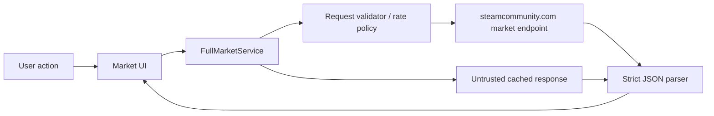

# CR-005 Steam 全市场数据安全与合规设计（G2）

## 1. 结论

Steam Community Market `search/render` 技术上可匿名返回全市场可检索目录，但它是官方网页内部端点，不是 Valve 面向第三方桌面客户端承诺的正式 API。G3 只能实现低频、用户可见、按需分页与强缓存；自动全量镜像属于阻断项，需 Valve 书面许可或适用合作伙伴接口后重新设计。

## 2. 信任边界

Steam 响应、缓存 JSON、物品名称/类型/图标 URL全部视为不可信数据；只有 HTTPS 精确主机 `steamcommunity.com` 和受控路径可访问。

## 3. 威胁模型

| 威胁 | 风险 | 控制 | 验证 |
|---|---|---|---|
| 端点结构变化 | 字段错位、错误总数、崩溃 | schema 校验、类型/范围上限、解析失败整页回滚 | fixture 变异测试 |
| 限流/封禁 | 429/403、IP 或账户风险 | 单并发、≥1.5s 间隔、Retry-After、停止预取 | 429 集成测试 |
| 自动化条款 | 全量/后台采集触犯条款 | 禁止自动遍历、用户动作驱动、发布前合规门禁 | 网络调用审计 |
| 数值欺骗 | 缓存/示例数字被当实时 | 来源、范围、币种、时间、origin 强制字段 | UI 状态测试 |
| 资源耗尽 | 52 万 total_count 导致预分配/循环 | total_count 只作 qint64 元数据，页最多 10/服务返回值 | 大数边界测试 |
| 注入/富文本 | 名称或 type 包含 HTML | 纯文本控件、禁止解释 HTML、长度限制 | 恶意字符串测试 |
| 恶意图标 URL | 非 Steam 主机跟踪/协议攻击 | 仅 HTTPS + Steam CDN 主机白名单；否则占位图 | URL 策略测试 |
| 缓存投毒 | 半页或旧查询串页 | 查询哈希、事务写入、generation、结构版本 | 缓存键与竞态测试 |
| 密钥泄漏 | 未来 publisher key 入客户端 | 架构禁止客户端 partner API；无 key 配置项 | 二进制/仓库扫描 |
| Cookie 扩权 | 登录 Cookie 用于无人值守采集 | 目录客户端使用匿名网络上下文，不桥接认证 Cookie | 请求头/容器测试 |

## 4. 请求策略

- 目录查询使用独立匿名 `QNetworkAccessManager`，不携带 `SteamSessionService` Cookie；
- 同一时间最多 1 个目录请求；
- 初始概览请求全站热门页，其余 appid 计数错峰；
- 用户翻页才请求下一页，不自动预取完整目录；
- 429：停止新请求，优先采用 `Retry-After`，无值时 30/60/120 秒退避；
- 403、验证码或非 JSON：停止会话内自动重试，显示安全降级；
- 不使用代理轮换、User-Agent 轮换、多账户、多进程或验证码绕过；
- 5xx/网络失败最多 2 次有界重试，且不突破全局最小间隔。

## 5. 输入与响应校验

输入：查询词最多 128 Unicode 字符；appid 仅正整数或空；offset 0..10,000,000；count 仍传 10；排序值白名单；币种由现有映射；语言白名单。

响应：

- Content-Type 允许 JSON；最大正文 2 MB；
- `success=true`，`start>=0`，`pagesize=1..100`，`total_count=0..10,000,000`；
- results 数量不得超过 pagesize；
- 名称/哈希名/type 各有长度上限并按纯文本展示；
- `sell_price` 与 `sell_listings` 必须为非负、安全整数；
- `asset_description.appid` 缺失时该行拒收，不用查询范围冒充；
- 任一结构性不变量失败，整页标记 `MARKET_SCHEMA_CHANGED`，不部分渲染为最新。

## 6. 数据与隐私

目录数据是公开市场数据，不包含账户隐私。查询词仍可能反映用户兴趣，默认只保存在本机缓存，不进遥测；日志记录查询哈希、范围、offset、耗时、状态码，不记录完整查询词和响应正文。

图标下载必须通过受控缓存、限制尺寸和 MIME，拒绝 SVG/HTML 主动内容；G3 可先不下载远端图标，使用现有安全图片管线或占位图。

## 7. 合规门禁

G3/G4 准入：

- 代码中不存在 `for offset < total_count` 的后台全量循环；
- 没有定时任务遍历目录页；
- 没有 partner publisher key、代理池、验证码绕过；
- UI 明确“Steam 官方市场公开页面数据 / 非 Valve 正式全市场 API”；
- 设置里没有“全量同步频率”；
- 网络日志可以证明请求由打开页面/翻页/筛选等用户动作触发。

G5 发布前必须复核当时 Steam Subscriber Agreement 和端点行为。如条款或响应阻止此用法，关闭在线目录能力并保留官方网页入口，不尝试绕过。

## 8. 正式全量镜像的新增授权条件

只有满足其一才可另立变更：

1. Valve 对本项目此种市场目录采集提供书面许可和速率边界；
2. 获得适用 `IEconMarketService` 权限，并将 publisher key 放在受控服务端；
3. 使用获得合法授权且契约明确的第三方数据集。

即使满足，也需要新的后端架构、密钥管理、隐私、成本、增量一致性和运维门禁，不属于当前桌面 G3。
