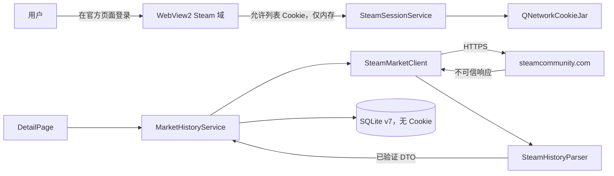

# CR-006 安全设计：真实市场历史

## 1. 安全目标

1. 历史读取只复用用户主动在 Steam 官方 WebView 建立的内存会话；
2. 密码、Steam Guard、Cookie、令牌、完整响应体和账户身份不进入日志、SQLite、截图或测试 fixture；
3. 只有通过主机、传输、业务和 schema 校验的响应可标记为在线并写入；
4. 限流、拒绝和会话失效不会触发高频重试或绕过；
5. fixture 与普通用户数据库隔离，不能污染真实来源状态。

## 2. 数据流与信任边界

信任边界：

- TB-1：WebView/Steam 页面 → 应用 CookieJar；
- TB-2：网络 → Parser，所有字节均不可信；
- TB-3：服务 → SQLite，仅已验证 DTO 可跨越；
- TB-4：测试 fixture → 产品数据库，必须通过路径与构建/运行模式隔离。

## 3. STRIDE 威胁模型

| 类别 | 威胁 | 等级 | 缓解 |
| --- | --- | --- | --- |
| Spoofing | 重定向到非 Steam 域或伪造登录页 | 高 | HTTPS；WebView 导航主机允许列表；网络最终 URL 校验；不提供自建密码输入框 |
| Spoofing | 缓存/fixture 被标为 Steam 在线 | 高 | `source_kind` + `fetched_at` 数据约束；普通 DB 禁止 fixture；状态契约测试 |
| Tampering | JSON 字段/价格/时间被篡改或改版 | 高 | Content-Type、8 MiB 上限、`success`、schema、数值范围、有效率阈值；失败不写库 |
| Tampering | SQLite 历史或同步状态部分写入 | 中 | 单事务点写入 + sync state；约束、索引、备份与完整性检查 |
| Repudiation | 无法判断某条曲线来自何时/何处 | 中 | provenance、last attempt/success、点数/范围；结构化脱敏日志 |
| Information disclosure | Cookie/SteamID 进入日志或测试截图 | 高 | 日志字段白名单；禁止响应体；截图仅裁剪图表并遮蔽账户卡；测试报告不记身份 |
| Information disclosure | Cookie 持久化到 SQLite/设置 | 高 | 模型和迁移无凭据字段；Cookie 仅 QNetworkCookieJar 内存；退出清理 WebView + Qt Jar |
| Denial of service | 用户重复刷新或自动重试触发 429 | 高 | 单 key 单并发；全局 1.5s 下限；按钮防抖；429 无普通重试；Retry-After 1～900s |
| Denial of service | 超大/畸形响应耗尽内存 | 中 | 响应体 8 MiB 上限；50,000 点上限；解析前检查；失败释放 reply |
| Elevation of privilege | 游客绕过身份状态直接发历史请求 | 中 | `MarketHistoryService` 在发请求前消费 `IdentitySnapshot`；UI 状态不作为授权依据 |
| Elevation of privilege | 过期 Cookie 仍被当认证成功 | 中 | 最终 URL/Content-Type/业务结果校验；明确证据时调用 `markSessionRejected`；无证据不武断注销 |

## 4. 认证与会话设计

- 唯一身份源保持 `SteamSessionService`；历史模块不得创建第二套登录状态；
- 登录页面只允许 `https` 且主机后缀属于 Steam 已批准列表；
- WebView → Qt CookieJar 采用必要 Cookie 名称允许列表，G3 需通过真实接口验证最小集合；不得把所有跟踪/偏好 Cookie 无差别复制；
- Cookie 值不得出现在 qDebug/qInfo/qWarning、异常文本、URL、数据库、崩溃报告和 UI；
- 详情页仅发送 `loginRequested(HistoryKey)` 意图，由 AppController 启动官方登录并登记一次性重试；
- 只有以下明确证据可把已认证状态降为 Expired：最终 URL 进入 Steam 登录页、必要认证 Cookie 已过期/缺失且源明确要求认证、或 Steam 返回明确认证失败信号；一般 400/403 不等同会话过期；
- 退出时清理 WebView 和 QNetworkCookieJar；缓存历史保留并标记 cache。

## 5. 网络与输入验证

### 5.1 请求

- `marketHashName` 1～256 字符，通过 `QUrlQuery` 编码，禁止字符串拼 URL；
- `appid >0` 且来自已选择物品；币种只允许 CNY/USD/EUR/RUB；
- GET 请求不携带 API key、密码或自定义认证 header；会话仅由 CookieJar 自动附加；
- 禁止把完整 URL 写日志，因为查询中含用户访问的物品名称。

### 5.2 响应

- HTTPS、最终主机、HTTP 状态、Content-Type、长度、JSON 顶层类型依次校验；
- `success=false`、缺失 `prices`、价格非正、非法时间、负数 volume 分别映射类型化错误/无效行；
- 数组非空但有效行比例 <95% 时整批拒绝，防止字段静默变化；
- 明确空数组与解析失败分离；空数组不生成 fixture、不删除已有缓存；
- 原始 body 只在内存存活到解析完成，不保存到磁盘或日志。

## 6. 错误与重试策略

| 情况 | 错误码 | 自动重试 | 会话动作 |
| --- | --- | --- | --- |
| 无已认证身份 | AUTH_REQUIRED | 否；登录成功后一次 | 保持游客/当前状态 |
| 明确登录重定向/认证失效 | SESSION_EXPIRED | 否 | 标记 Expired |
| 429 | RATE_LIMITED | 否 | 保持会话；尊重 Retry-After |
| 403 且无认证失效证据 | SOURCE_REJECTED | 否 | 不自动注销 |
| 超时/临时网络错误 | NETWORK_UNAVAILABLE | 最多 1 次退避 | 不改变会话 |
| schema/有效率异常 | SOURCE_SCHEMA_CHANGED | 否 | 不改变会话，禁写库 |
| 数据库失败 | DATABASE_ERROR | 否 | 保留内存结果但不得标持久化成功 |

缓存存在时，错误作为 `HistoryDataset.warning` 返回；缓存不存在时返回终止状态。错误消息只使用本地 message key，不拼接远端 HTML/body。

## 7. 日志、指标与隐私

允许日志字段：

- requestId（随机局部 ID）、appid、marketHashName 的 SHA-256 前 12 位、currency；
- HTTP status、结果状态、点数、无效/重复点数、耗时、错误码；
- schema version 与迁移结果。

禁止字段：

- Cookie 名和值、SteamID、displayName、登录 URL 查询、完整 marketHashName、响应体、请求 header；
- 本地数据库绝对路径中的用户名；对外报告只显示 `%APPDATA%` 逻辑位置。

日志保留沿用滚动策略；真实联网测试的脱敏截图只截取物品标题/图表/来源条，隐藏侧栏账户卡和通知区域。

## 8. fixture 与测试隔离

- `smoke_fixture` 只允许 `--smoke-test` 且数据库规范化路径必须位于当前进程创建的 `smt_smoke_<uuid>` 临时目录；
- 若普通路径尝试写入 `smoke_fixture`，仓储返回 `DATABASE_ERROR` 并记录不含路径的安全事件；
- 网络 fixture 是版本控制内的脱敏最小 JSON，只含虚构物品名/时间/价格，不得从真实已登录响应原样保存；
- 真实账户测试不导出 HAR、不启用 WebView DevTools、不复制 Cookie。

## 9. G4 安全测试要点

1. 非 Steam 重定向被阻断；HTML 登录页不交给 JSON Parser；
2. 429、403、400、`success=false`、畸形 JSON、超大响应、非法时间/价格/volume；
3. 登录成功一次性重试、取消、过期、登出后 CookieJar 清空；
4. 日志/SQLite/截图搜索 `steamLoginSecure`、`sessionid`、SteamID64 和 Cookie 模式均无命中；
5. 普通数据库写 fixture 被拒绝；
6. v7 备份与失败恢复不泄漏凭据（库本身不得含凭据）；
7. 真实测试只记录 appid、物品、点数、首末时间和脱敏截图。

## 10. 上线安全清单

- [ ] WebView DevTools 与默认上下文菜单关闭；
- [ ] 最终 URL/HTTPS/主机、Content-Type、大小和 schema 校验启用；
- [ ] Cookie 允许列表经真实接口验证且最小化；
- [ ] 日志字段白名单测试通过；
- [ ] 429/403 不触发高频重试；
- [ ] 普通模式 fixture 写入保护通过；
- [ ] 无高危安全缺陷；
- [ ] 发布说明包含非正式网页端点、用户主动登录和非逐笔数据口径。

