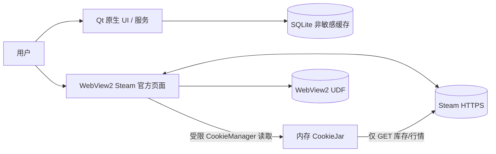

# v4 安全设计与威胁模型（CR-003）

## 1. 安全目标

1. 用户只在 Steam 官方页面输入密码与 Steam Guard；原生 UI、SQLite、日志不接触密码；
2. 会话 Cookie 不出现在 UI、日志、崩溃报告或数据库，只在 WebView2 UDF 与进程内存中存在；
3. 原生应用不提交市场交易 POST，不自动批准手机/邮件确认；
4. 远程网页不能调用任意本地能力或读取本地数据库；
5. Steam 限流、结构变化和会话过期必须安全失败。

## 2. 信任边界

边界：WebView2 内容按不可信远程内容处理，即使来自 Steam；只允许显示和导航，不授予本地文件、数据库或命令执行能力。

## 3. STRIDE

| 威胁 | 场景 | 等级 | 缓解 |
| --- | --- | --- | --- |
| Spoofing | 恶意页面伪装 Steam 登录 | 高 | 顶部固定显示当前主机；主文档导航仅允许 `https` + Steam 官方主机；非白名单立即阻断并提示 |
| Spoofing | 旧 Cookie/会话固定 | 中 | 登录后验证 SteamID；账号变化清空内存 CookieJar 与进行中的草稿；会话失败转 expired |
| Tampering | 远程页面调用本地功能 | 高 | 不调用 `AddHostObjectToScript`；不提供通用 WebMessage 命令；禁用本地文件导航 |
| Tampering | 缓存资产被修改导致错误选择 | 高 | SQLite 约束；交接前检查同步时间；超过 5 分钟或资产数量变化强制重同步 |
| Repudiation | 用户误以为应用已上架 | 中 | 状态只到 `handed_off`；记录打开时间与草稿摘要；不记录为 success |
| Information Disclosure | Cookie 写日志/DB/剪贴板 | 高 | Cookie 类型不提供 `toString` 日志；禁止原始网络头/查询串；数据库无 Cookie 字段；不支持手工粘贴 Cookie |
| Information Disclosure | WebView2 UDF 被其他本机用户读取 | 中 | UDF 位于当前用户 LocalAppData；启动校验目录不为链接/重解析点；继承当前用户 ACL；不进入备份 |
| DoS | 429 或分页游标循环 | 中 | 串行限速、Retry-After、最大页数 50、游标前进检查、可取消 |
| Elevation of Privilege | WebView2 漏洞/下载执行 | 高 | Evergreen 自动更新；禁用下载；不允许打开本地文件/外部协议；依赖版本与 Runtime 健康检查 |
| Elevation of Privilege | WebView2 新窗口绕过白名单 | 高 | 拦截 `NewWindowRequested`；允许的 Steam URL在同一视图打开，其余交系统浏览器且需用户确认 |

## 4. 官方页面与导航策略

### 顶级导航白名单

- `login.steampowered.com`
- `steamcommunity.com` 及精确子域白名单（不使用字符串后缀模糊匹配）
- `store.steampowered.com`
- `help.steampowered.com`

静态资源可由 WebView2 按页面正常加载；顶级导航到其他域名时阻断并询问是否在系统浏览器打开。禁止 `file:`, `data:`, `javascript:`, `steam:` 等非 HTTPS 顶级导航；如未来需要 `steam:`，必须单独走变更审批。

WebView2 设置：

- `AreDevToolsEnabled=false`（正式版）；
- `AreDefaultScriptDialogsEnabled=true`（Steam 登录可能需要）；
- `AreHostObjectsAllowed=false`；
- `IsStatusBarEnabled=true` 或原生域名栏常显；
- 下载事件一律取消；
- 权限请求（摄像头、麦克风、地理位置、通知）默认拒绝；
- 不执行注入式自动点击、表单填写或确认。

## 5. 会话设计

- WebView2 UDF：`%LOCALAPPDATA%/SteamMarketTerminal/WebView2/<profile-id>`；
- 原生同步前通过 CookieManager 只读取 `steamcommunity.com` 必要 Cookie，复制到自定义内存 CookieJar；
- 允许名称：`steamLoginSecure`、`sessionid`、Steam 登录流程实际必需且经测试确认的附加 Cookie；新增名称必须代码评审；
- 原生 CookieJar 只服务 HTTPS GET，进程退出/登出/账号切换即清空；
- SQLite `steam_accounts` 只保存 SteamID、显示名和状态；
- “退出 Steam”调用 WebView2 清除站点数据与内存 CookieJar；“记住登录”由 WebView2 官方 Cookie策略决定，应用不伪造持久 Cookie；
- v3 `sessions` 表进入遗留只读状态，v4 不实例化旧密码登录服务、不解密旧 Cookie；用户执行“清除本地登录”时一并清空。

## 6. 网络安全

- 仅 HTTPS，使用 Windows/Chromium 和 Qt 默认系统证书校验；证书错误不得忽略；
- 只允许 Steam 官方库存、行情 GET；不跟随跨域重定向到非白名单；
- 请求头不记录；响应体上限 16MB；Content-Type/JSON 结构校验；
- 429 后停止而不是并发重试；401/403 触发会话失效或权限诊断；
- 原生层明确禁止 `/market/sellitem`、`/market/createbuyorder`、确认接口 POST。

## 7. 输入与输出校验

- SteamID：17 位十进制字符串；不转 double；
- appid：配置白名单正整数；contextid：1–20 位数字字符串；
- assetid/classid/instanceid：1–32 位数字字符串；
- market_hash_name：UTF-8 ≤256 字符，URL 参数必须由 `QUrlQuery` 编码；
- 图片仅使用 Steam CDN HTTPS；失败显示本地占位，不解析 SVG 脚本；
- 标签 JSON 限制数组长度 100、单字段 256 字符；
- 官方 URL 总长 ≤1800 字节、单批 ≤40 组。

## 8. 合规边界

- 应用只在用户主动点击时同步库存、生成草稿并打开官方页面；
- 不后台循环选择或交易，不自动操作 Steam 页面，不自动确认；
- Steam 官方页面的提交按钮必须由用户亲自点击；
- 页面打开不等于上架成功，本地不作成功声明；
- 用户协议或页面结构变化时可远程端点总开关关闭相关入口，但不能静默绕过限制。

## 9. 安全测试基线（G4）

- 导航白名单绕过：大小写、尾点、Unicode、`steamcommunity.com.evil.test`、userinfo、重定向；
- Cookie 泄露：日志、SQLite、崩溃输出、剪贴板全文扫描；
- WebView2：下载、权限、新窗口、开发者工具、非 HTTPS；
- JSON：超大响应、深层嵌套、缺 descriptions、重复 assetid、游标循环；
- 会话：过期、账号切换、退出清理、UDF 不可写；
- 草稿：过期库存、金额溢出、负价、极长 URL、跨 context 混批；
- 依赖：WebView2 SDK/Loader 签名、固定版本、许可证与已知漏洞扫描。

## 10. 上线安全清单

- [ ] 不包含 v3 密码输入或 Cookie 粘贴控件；
- [ ] 不实例化旧 AuthService 自动登录路径；
- [ ] 正式包禁用 DevTools/下载/HostObject；
- [ ] 日志与数据库敏感信息扫描通过；
- [ ] WebView2 Runtime 缺失时安全降级；
- [ ] 所有市场 POST 自动化路径不可达；
- [ ] 官方域名与“需要手机/邮件确认”文案常显。
