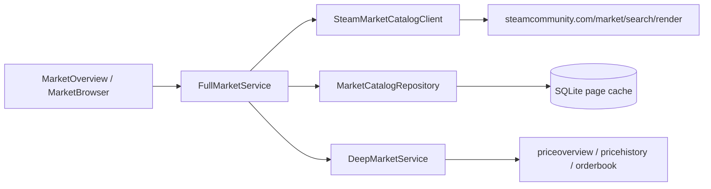

# CR-004 Steam 全市场概览架构修订（G2）

## 1. 范围定义

“Steam 全市场”定义为 Steam Community Market 在当前查询条件、币种、语言与时刻返回的**全部可检索结果集合**。它不是本地关注列表，也不承诺覆盖不可交易、已下架、地区不可见或 Steam 未返回的物品。

UI 必须显示：

- 来源：`Steam Community Market`；
- 查询范围：全站或指定 appid；
- Steam 返回的 `total_count`；
- 采集/查询时间、币种和当前缓存状态；
- 数据接口不可用时的缓存时间和降级说明。

## 2. 一手接口结论

### 2.1 可用来源

Steam Community Market 官方网页自身使用：

```http
GET https://steamcommunity.com/market/search/render/
  ?query=
  &start=0
  &count=100
  &search_descriptions=0
  &sort_column=popular
  &sort_dir=desc
  &appid=<optional>
  &norender=1
  &currency=23
  &l=schinese
```

2026-08-13 设计验证：

| 范围 | Steam `total_count` |
|---|---:|
| 全站 | 527,988 |
| CS2 / 730 | 35,237 |
| Dota 2 / 570 | 33,703 |
| Team Fortress 2 / 440 | 41,314 |
| Steam 社区物品 / 753 | 321,575 |

这些数字是瞬时实测，不写死到产品；运行时以最新响应为准。

响应可直接提供：结果总数、物品标识、appid、名称、图标、最低挂单价/格式化价格、当前挂单数量以及分页信息。客户端现有实现已使用该官方域名端点，但只取第一页 30 条，需要扩展分页与字段解析。

### 2.2 不可假设的能力

- 公开 Steamworks Web API 参考没有为普通桌面客户端提供全市场枚举接口；
- `IEconMarketService.GetPopular` 是合作伙伴受限接口，需要带 Economy 权限的发行商密钥，官方明确要求只能从安全服务器调用，不能把密钥放在客户端；
- `search/render` 不直接返回每个物品的 24h 涨跌、全市场成交额或完整价格历史；
- 因此概览不得展示无法由当前 Steam 响应证明的“全市场今日上涨/下跌/成交额”。

## 3. 技术方案比较

| 方案 | 优点 | 缺点 | 结论 |
|---|---|---|---|
| 每次启动全量抓取约 52 万结果 | 可构造完整本地镜像 | 数千分页请求、启动极慢、极易 429、合规和维护风险高 | 否决 |
| Steam 远端分页 + 已访问页缓存 | 首屏快、范围为全市场、请求量随用户需求增长 | 离线只能浏览已缓存页 | 采用 |
| 自建云端全量采集服务 | 可集中缓存与调度 | 新基础设施、密钥/合规/成本，不符合单机当前范围 | 后续需单独立项 |
| 合作伙伴 `GetPopular` | 官方文档稳定 | 无可用发行商 Economy 密钥且禁止客户端调用 | 不采用 |

## 4. 模块



- `SteamMarketCatalogClient`：构造分页/筛选/排序请求，解析 `total_count/results`，处理 429 与结构变化；
- `FullMarketService`：远端优先、缓存回退、范围摘要、请求取消和代次；
- `MarketCatalogRepository`：保存查询页、物品目录、来源快照和 TTL；
- `DeepMarketService`：用户选择或关注物品时才取详细历史/盘口，不对 52 万物品逐一调用。

现有 `SteamMarketClient::search()` 可逐步拆分/扩展，但服务层必须把“目录查询”和“单品深度行情”分开，避免一个全局串行队列被详情请求饿死。

## 5. 查询契约

```cpp
struct MarketCatalogQuery {
    QString query;
    std::optional<int> appid;
    QStringList categoryFilters;
    CatalogSort sort;      // Popular, PriceAsc, PriceDesc, NameAsc, QuantityDesc
    int offset = 0;
    int limit = 10;        // 2026-08-13 实测 Steam 即使 count=100 仍返回 pagesize=10
    QString currency = "CNY";
    QString language = "schinese";
};

struct MarketCatalogPage {
    MarketCatalogQuery query;
    qint64 totalCount = 0;
    QVector<MarketCatalogItem> items;
    QDateTime fetchedAt;
    DataOrigin origin;     // SteamLive / SteamCached
    bool stale = false;
};
```

`MarketCatalogItem`：`marketHashName`、`appid`、`localizedName`、`typeText`、`iconUrl`、`lowestSellMinor`、`sellListings`。价格采用 Steam 返回的整数最小币种单位；格式化文本只作为展示校验，不作为计算源。

稳定错误码：`MARKET_RATE_LIMITED`、`MARKET_SCHEMA_CHANGED`、`MARKET_PAGE_OUT_OF_RANGE`、`MARKET_OFFLINE_NO_CACHE`、`MARKET_CURRENCY_UNSUPPORTED`。

## 6. 概览指标

可以直接作为全市场指标：

1. `可检索物品`：当前全站 `total_count`；
2. `CS2 / DOTA2 / TF2 / 社区物品`：分别查询 appid 的 `total_count`；
3. `热门物品`：`sort_column=popular` 首页结果；
4. `当前挂单量`：热门结果中的 `sell_listings`；
5. `最低挂单价`：结果中的 `sell_price`；
6. `市场分布`：已知重点 appid 数量及“其他”差值，明确为当前可检索结果分布。

需要本地持续采样后才能展示：

- 物品价格变化、挂单量变化；
- 24h 涨跌榜；
- 新增/消失物品；
- 全市场快照间变化。

即便有持续采样，也应标为“基于已采集目录快照”，不能伪装为 Steam 官方 24h 指标。

## 7. 请求与限流

- 首屏预算：全站总数/热门页 1 次；重点游戏计数按需并错峰，不在启动同时突发；
- 用户翻页：同一查询只允许 1 个在途请求，新查询取消旧代次；
- 默认最小间隔沿用至少 1.5 秒，收到 429 优先尊重 `Retry-After`，否则 30/60/120 秒退避；
- 429 后停止预取，不自动扫完整市场；
- 页面缓存 TTL：热门/总数 10 分钟，普通搜索页 30 分钟；实测约 52.8 万结果需约 52,799 次请求才能遍历，因此禁止后台全量扫描；离线允许读取旧缓存并标记时间；
- 不绕过 Steam 防护、不轮换代理、不并行刷页、不使用登录账户规避限流。

## 8. 页面加载策略

### 市场概览

1. 立即渲染最近缓存；
2. 请求全站热门第一页，响应同时得到 `total_count`；
3. 错峰请求重点游戏 `total_count`，逐卡更新；
4. 用户选择某游戏时才加载该范围热门页；
5. 深度趋势面板只针对当前选中物品请求，不批量展开。

### 物品浏览

远端查询是事实源，SQLite 只是页缓存。翻页或筛选直接改变 Steam 请求参数；结果范围显示 `第 x–y 项 / 共 total_count 项`。离线只允许浏览缓存命中的查询页，并明确“不代表完整离线镜像”。

## 9. 合规与产品声明

`search/render` 属于 Steam Community Market 官方网页端点，但不在公开 Steamworks API 稳定契约中。架构必须容忍字段变化或端点停止工作，不把它描述成“官方支持的全市场 Web API”。

Steam 订户协议对自动化交互有广泛限制。产品只做低频、用户可见的数据读取，不自动交易、不规避限流；正式发布前仍需法律/条款复核。若 Valve 明确禁止此类读取或端点要求不再满足，应停用在线全市场采集并保留缓存/官方网页入口。

## 10. 验证

- 解析固定响应 fixture：total_count、appid、价格最小单位、挂单量和图标；
- 全站/游戏/搜索/空结果/越界分页；
- 429 + Retry-After、超时、JSON/HTML 结构变化；
- 新查询取消旧结果，过期回调不得覆盖当前页；
- 缓存键包含 query/appid/filter/sort/currency/language/offset/limit；
- 离线命中/未命中与 stale 展示；
- UI 不出现无法证明的全市场 24h 涨跌或成交额。

## 11. G3 实现切片

1. 扩展客户端分页字段与 fixture 测试；
2. 新增目录查询 DTO、服务、缓存仓储与迁移；
3. 市场概览接入全站/游戏 total_count 和热门页；
4. 物品浏览接入远端筛选、分页与快速预览；
5. 限流/缓存/结构变化 smoke；
6. 真实 Steam 联网人工验收，不把实测结果写死。
