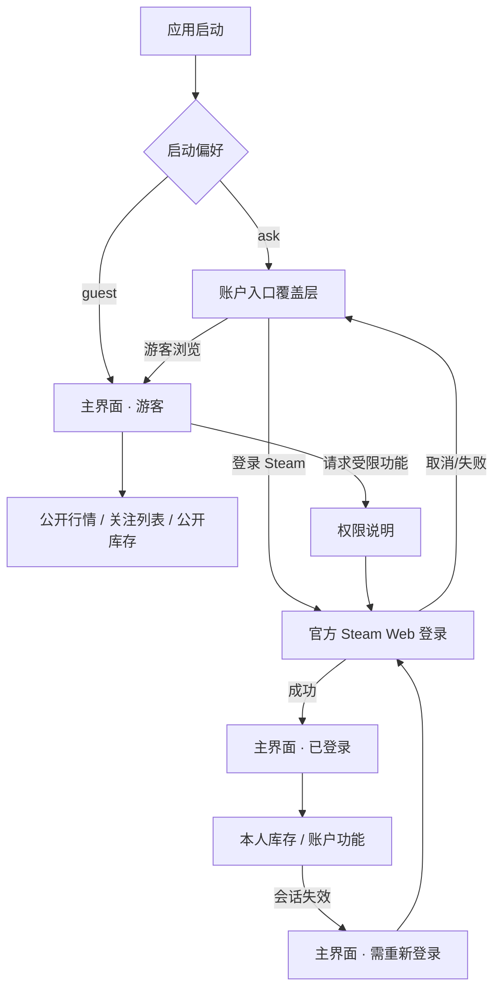

# CR-004 账户入口 UX 设计（G2）

## 1. 体验目标

用户在 10 秒内理解两件事：不登录也能浏览公开市场；只有私有库存与账户动作需要登录。启动选择可撤销、可降级，不制造被迫登录感。

## 2. 信息架构

全局账户卡是唯一长期身份入口；欢迎页消失后，用户仍可切换、登录或注销。

## 3. 启动欢迎流

### 默认态

- 主窗口骨架已出现，中央覆盖层承载品牌和两个等权模式卡；
- 左卡“游客浏览”带“推荐”徽标，但右卡“登录 Steam”在视觉尺寸和可发现性上等权；
- 默认键盘焦点在游客主按钮；Tab 顺序：游客按钮 → 登录按钮 → 下次直接游客复选框 → 帮助链接；
- `Esc` 不关闭覆盖层，避免进入身份未定义态；窗口关闭仍可用。

精确文案：

- 标题：`欢迎使用 Steam Market Terminal`
- 副标题：`先选择使用方式，之后可随时在账户卡中切换。`
- 游客说明：`浏览公开市场、管理本地关注列表，也可输入 SteamID 查看公开库存。`
- 游客按钮：`以游客身份进入`
- 登录说明：`通过 Steam 官方页面登录，以访问本人库存和需要账户会话的功能。`
- 登录按钮：`登录 Steam`
- 安全提示：`凭据仅在 Steam 官方页面输入；本应用不保存密码。`
- 偏好：`下次直接以游客身份进入`

### 加载态

点击登录后卡片内显示 16 px 进度环与 `正在准备安全登录环境…`，两张卡保持布局稳定；游客按钮仍可取消登录准备并进入游客。WebView 打开后覆盖层隐藏但不销毁，登录取消可恢复原位。

### WebView 不可用

登录卡变为警告态：`当前无法启动 Steam 登录组件。你仍可使用游客模式。` 提供 `重新检测` 次级按钮；不展示下载链接或技术堆栈。

### Steam 不可达

提示 `暂时无法连接 Steam。请检查网络后重试，或先以游客身份继续。` 操作：`重试`、`游客继续`。

## 4. 全局账户卡

位于侧栏底部、导航之外但保持同一对齐网格，高度 72–96 px。

| 状态 | 主标题 | 辅助信息 | 主操作 |
|---|---|---|---|
| Guest | 游客模式 | 公开市场与本地功能可用 | 登录 Steam |
| PublicInventory | 公开库存 | SteamID 尾号 + 同步摘要 | 切换账户 |
| Authenticating | 正在登录 | 请在 Steam 官方页面完成 | 取消 |
| Authenticated | Steam 显示名 | 本人库存可用 · 同步摘要 | 账户菜单 |
| Expired | 需要重新登录 | 会话已失效，公开功能仍可用 | 重新登录 |

账户菜单：`查看本人库存`、`打开 Steam 社区`、`切换为游客`、分隔线、`注销并清除会话`。危险操作仅“注销并清除会话”使用警告色；切游客不宣称已清 Cookie，若语义需要清理则执行同一安全注销命令。

## 5. 受限功能流

游客点击本人库存时，不导航到空白页。目标区域原位显示受限态：锁图标、标题 `登录后查看本人库存`、一句能力说明、主按钮 `登录 Steam`、次按钮 `输入 SteamID 查看公开库存`。

若从受限态发起登录，成功后自动导航回库存且只执行一次；取消后保持受限态，焦点回到原按钮。

会话失效不弹阻断对话框：页面顶部显示持久警告条，私有内容用受限态替代，公开行情和关注列表继续工作。

## 6. 公开 SteamID 流

输入框标签 `SteamID64`，辅助文案 `仅查询公开可见的库存信息`。提交前做格式校验；库存私密时显示 `该库存未公开，无法读取`，不暗示登录可绕过对方隐私设置。

## 7. 导航与返回

- 欢迎层不是导航历史条目；完成选择后落在上次有效主页面，首次安装落在市场首页；
- 登录 WebView 是受控表面，关闭等同取消，不退出应用；
- 受限功能记录一个待执行意图，不建立多层重定向链；
- 状态变化不自动抢占用户当前页面，只有用户发起的待执行意图成功后才导航。

## 8. 无障碍

- 所有状态同时使用文本、图标与颜色，不只靠颜色；
- 焦点环 2 px，和背景对比不低于 3:1；正文对比目标 4.5:1；
- 卡片可点击区域不替代明确按钮，避免辅助技术重复朗读；
- 进度动画提供文本，减少动态设置下取消位移与光带动画；
- 错误出现后通过可访问名称播报，但不强制移动键盘焦点；
- 125%–200% Windows 缩放下不截断主操作和安全提示。

## 9. 响应式

- ≥1180 dp：两张模式卡横排，覆盖层内容最大宽 960 dp；
- 900–1179 dp：卡片横排但缩小内边距，品牌标题不超过两行；
- <900 dp：卡片纵排，游客在前；账户卡仅缩短辅助信息，不隐藏状态；
- 最小支持窗口 1040×680；高 DPI 以逻辑像素布局，不按物理像素硬编码。

## 10. 可用性验收

1. 新用户能在不阅读帮助的情况下找到游客入口；
2. 用户明确知道登录发生在 Steam 官方页面；
3. 游客访问受限功能时知道原因和下一步；
4. 登录失败不会丢失当前任务或迫使退出；
5. 账户状态在任何主页面都可见；
6. 键盘可完成选择、登录取消、输入公开 SteamID 和注销。
