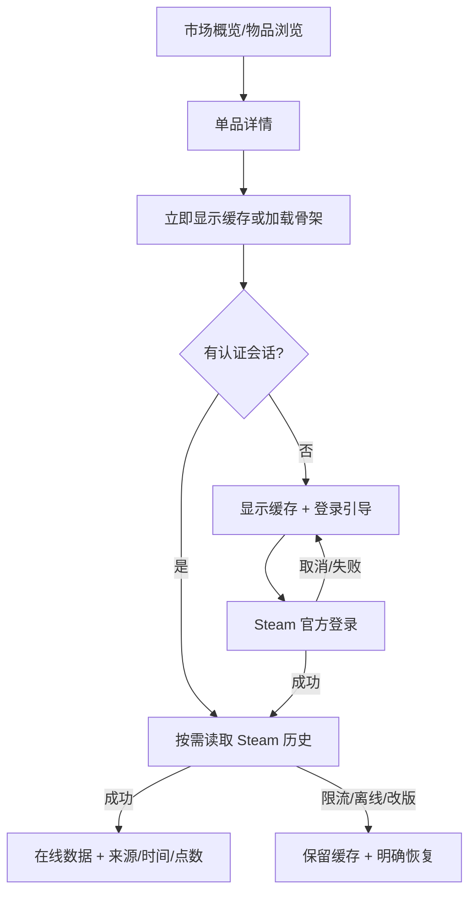

# CR-006 UX：真实走势读取与恢复流程

## 1. 信息架构

详情页保留现有入口，不新增一级导航。信息优先级调整为：

1. 物品与当前价格；
2. 历史数据来源/新鲜度/范围；
3. 价格与成交量走势；
4. 盘口与平台比价；
5. 统计说明与恢复动作。

## 2. 交互原则

- 缓存优先：打开详情不等待网络才出现内容；
- 状态在图表附近：错误和来源不藏在全局状态栏；
- 登录是恢复动作，不是弹窗惩罚：游客可查看缓存和其他公开功能；
- 周期切换是本地筛选，不产生网络请求；
- 不用绿色单独代表“真实”，必须有“Steam 在线数据/缓存/来源未知”等文字；
- 不自动填平断档，不把稀疏点画成连续高频行情。

## 3. 状态流程

| 状态 | 标题 | 辅助信息 | 主动作 | 图表 |
| --- | --- | --- | --- | --- |
| Loading/no cache | 正在读取 Steam 历史 | 仅请求当前物品 | 取消/无 | 骨架 |
| Loading/with cache | 正在刷新 · 当前显示缓存 | 缓存时间、点数 | 无 | 保留缓存 |
| Online | Steam 在线数据 | 币种、查询时间、点数、首末时间 | 刷新 | 正常 |
| Cache | 缓存数据 | 最后成功时间 + 本次失败原因 | 重试/登录 | 正常，顶部缓存角标 |
| Auth required | 登录 Steam 获取官方历史 | 应用不接收密码；缓存是否可用 | 登录 Steam | 缓存或空状态 |
| Rate limited | Steam 请求过于频繁 | 可重试时间 | 倒计时后重试 | 缓存或空状态 |
| Empty | Steam 暂无历史点 | 本次查询时间 | 稍后刷新/官方页面 | 空状态 |
| Source changed | Steam 数据格式暂不可用 | 已停止写入以保护缓存 | 重试/官方页面 | 缓存或空状态 |
| Offline | 网络不可用 | 缓存时间或无缓存 | 重试 | 缓存或空状态 |

## 4. 任务恢复

- 用户从详情页点击登录时保存 `HistoryKey + 当前周期 + generation`；
- 登录成功后回到同一详情页并自动重试一次，不跳转库存页；
- 登录取消或失败后保留物品、周期、缓存和滚动位置；
- 用户在登录期间切换物品，旧物品自动重试不得覆盖新详情；
- 会话过期时显示非阻塞状态条，不清空本地曲线。

## 5. 文案口径

采用：

- “Steam 在线数据”
- “缓存数据 · 最后更新 14:32”
- “24h 历史点”
- “日 K（按 Steam 历史点聚合）”
- “该区间仅 1 个有效点，无法形成趋势”
- “存在数据断档，未进行插值”

禁止：

- “实时逐笔”“分钟级行情”“官方 API 保证”“交易所 K 线”；
- 在缓存刷新失败时显示“数据已更新”；
- 将 `legacy_unknown` 显示成“Steam 在线”。

## 6. 键盘与可访问性

- Tab 顺序：返回 → 自选 → 提醒 → 周期 → 刷新/登录 → 图表 → 后续面板；
- `Ctrl+R` 仅在详情页触发一次手动刷新；请求中禁用；
- 图表悬停信息同时支持键盘左右选择最近数据点；
- 状态图标配文字；图表线与背景达到 3:1，正文达到 4.5:1；
- 颜色方案切换只影响涨跌含义，不影响在线/缓存语义；
- 减少动态开启时禁用骨架 shimmer，仅保留静态占位。

