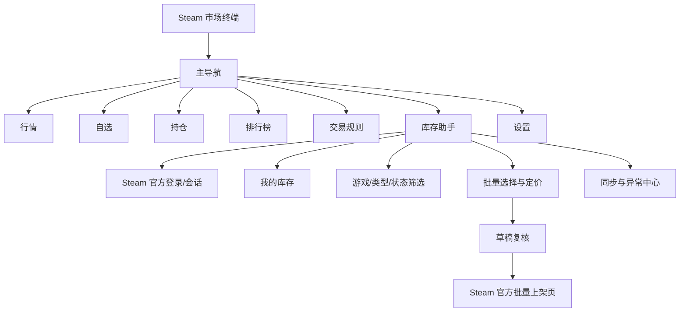
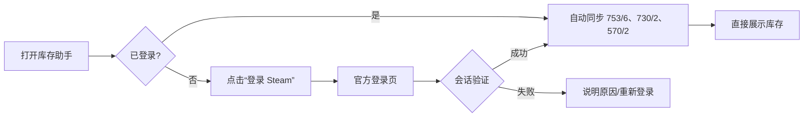
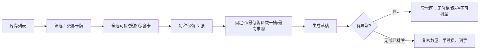
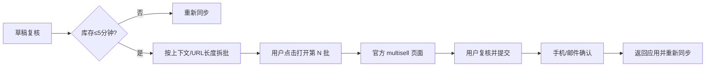

# v4 用户流程与信息架构（CR-003）

## 1. 信息架构

左侧导航将“自动交易”更名为“库存助手”，降低无人值守交易误导。

## 2. 核心流程

### 2.1 首次登录与自动同步（US-24）

登录页必须显示：Steam 官方域名、应用不保存密码、Steam Guard 由官方处理。用户关闭登录窗口时返回未登录空态，不生成错误弹窗。

### 2.2 卡牌批量选择与定价（US-25/26）

### 2.3 Steam 官方页面交接（US-27）

应用状态只显示“已交接到 Steam”，不显示“已上架成功”。

## 3. 页面层级与状态

| 区域 | 默认 | 加载 | 空 | 错误/降级 |
| --- | --- | --- | --- | --- |
| 账号栏 | 头像、名称、同步时间 | 验证会话 | 未登录 CTA | 会话过期/Runtime 缺失 |
| 筛选栏 | 游戏/类型/状态/文本 | 禁用并保留选择 | 无可用筛选 | 仍可筛缓存 |
| 库存表 | 分组库存 | 骨架行 + 进度 | 无物品说明 | 缓存角标/错误码/重试 |
| 定价面板 | 未选择提示 | 正在报价 | 0 个可售项 | 异常项列表 |
| 任务中心 | 最近同步摘要 | 分页进度/可取消 | 无任务 | 429 倒计时/失败页码 |

## 4. 导航与返回

- 库存工作台是单页主流程，不用多层弹窗；
- 草稿复核使用右侧抽屉扩展为全宽复核层，Esc 返回且保留草稿；
- Steam 官方页面在独立受控窗口打开，关闭后返回原草稿；
- 登录与官方上架窗口都必须常显域名，不做无边框伪装；
- 状态中心错误项可点击定位到对应上下文或物品。

## 5. 键盘流程

- `Ctrl+R`：同步库存；
- `Ctrl+F`：聚焦库存筛选；
- `Space`：切换当前行选择；
- `Ctrl+A`：在当前筛选结果中选择全部可售；
- `Ctrl+Enter`：生成/刷新草稿，不直接打开 Steam；
- `Enter`：打开选中物品详情；
- `Esc`：关闭抽屉/官方窗口或取消筛选焦点。

## 6. 体验原则

- 先显示库存，再提供搜索；搜索是筛选工具；
- 每个批量操作都显示“选中组数/资产数/预计到手/异常数”；
- 价格数据必须显示更新时间，不用“实时”误导；
- 不用单一颜色表达状态，配合图标和文字；
- 高风险动作按钮文案为“在 Steam 中复核并上架”，不使用“自动卖出”。
