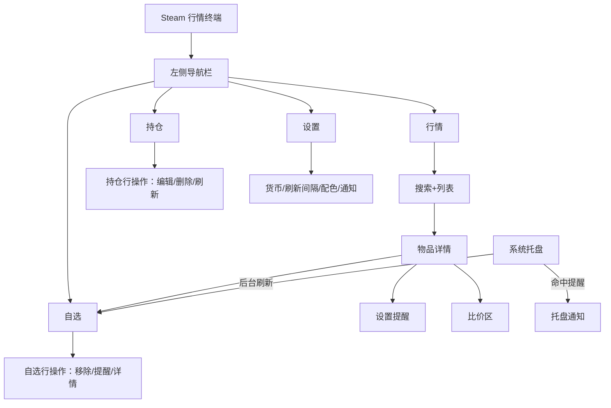
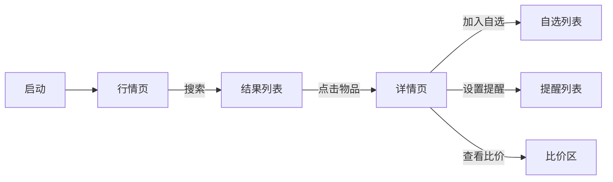
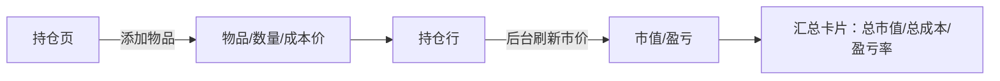
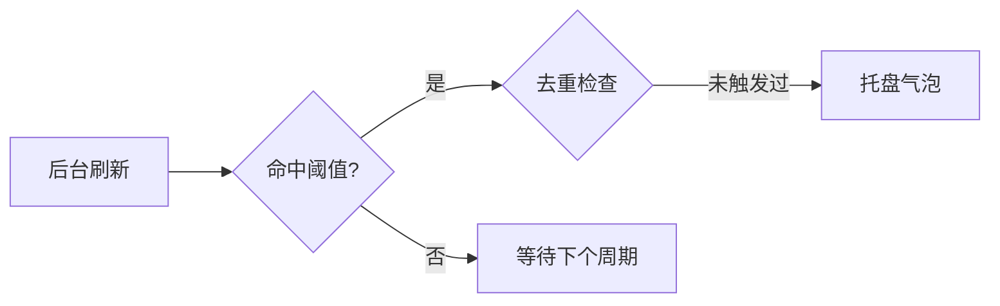

# 用户流程与信息架构

> UI/UX 设计师交付物（阶段 2）。

## 1. 信息架构

## 2. 主流程

### 2.1 查价与跟踪（US-01/02/03/04）

入口：行情页搜索框；出口：详情页"加入自选/设置提醒/比价"。

### 2.2 估值（US-05）

### 2.3 提醒触达（US-04/09）

## 3. 页面层级与状态

| 页面 | 入口 | 关键状态 |
| --- | --- | --- |
| 行情页 | 启动默认 | 加载中 / 有结果 / 空结果 / 接口错误 |
| 详情页 | 点击列表/自选/持仓行 | 加载中 / 正常 / 离线(缓存) / 数据不足 |
| 自选页 | 导航 | 空列表引导 / 正常 / 部分行更新失败 |
| 持仓页 | 导航 | 空列表引导 / 正常 / 部分行无市价 |
| 设置页 | 导航 | 正常 / 校验错误 |
| 托盘 | 常驻 | 正常 / 通知 |
