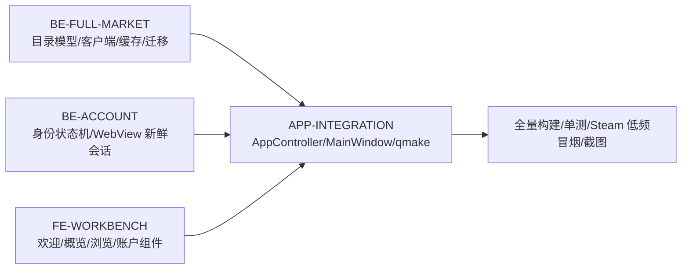

# CR-004 + CR-005 G3 模块实施计划

## 1. 冻结契约

以下文件在 G3 中只读，变更必须回到 G2：

- `docs/design/architecture-CR-004-account-entry.md`
- `docs/design/account-contract-CR-004.md`
- `docs/design/steam-full-market-architecture-CR-004.md`
- `docs/design/api-contract-CR-005-steam-full-market.yaml`
- `docs/design/data-model-CR-005-steam-full-market.md`
- `docs/design/database-design-CR-004-full-market.md`
- `docs/design/security-CR-004-account-entry.md`
- `docs/design/security-CR-005-steam-full-market.md`
- `docs/design/workbench-ia-CR-004.md`
- `docs/design/ui-spec-CR-004-account-entry.md`
- `docs/design/design-tokens-CR-004-account-entry.md`

当前无契约阻塞项。

## 2. 模块 DAG

## 3. 模块清单

| 模块 | 负责目录/文件 | 需求 | 交付与自测 | 状态 |
|---|---|---|---|---|
| BE-FULL-MARKET | 新增目录模型、目录客户端/服务/仓储、迁移 0006、专属测试文件 | CR5-F1～F8、US-42～44 | fixture 解析、分页、缓存、错误分类、实现文档 | 进行中 |
| BE-ACCOUNT | `SteamSessionService`、`IWebSessionHost`、`WebView2SessionHost` 与专属测试 | CR4-F1～F8、US-30～36 | 状态转换、权限门、新鲜 Cookie 清理契约、实现文档 | 进行中 |
| FE-WORKBENCH | `src/ui/` 新组件/页面；不修改 AppController/MainWindow/构建文件 | US-37～44 | welcome/account/overview/browser default/loading/error/cached UI、实现文档 | 进行中 |
| APP-INTEGRATION | `src/app/`、`src/src.pro`、`tests/tests.pro`、资源与服务装配 | 全部 | 编译、路由/信号联调、smoke | 待上游 |
| INTEGRATION-TEST | 全工程与数据库 | 全部 | 迁移、单测、离线 smoke、低频 Steam 契约探针、多尺寸截图 | 待集成 |

## 4. 并发边界

- 模块代理不得修改冻结契约；
- `src/app/`、`src/src.pro`、`tests/tests.pro` 仅由主代理修改；
- 各模块只修改任务书列出的文件，不修改其他代理文件；
- 契约缺陷记录到 `docs/implementation/pending-issues.md` 并停止越界推断；
- 主代理在每轮交付后进行构建文件合并与接口一致性检查。

## 5. G3 准出

- [ ] 0006 迁移在空库和升级库成功，回滚/恢复路径记录；
- [ ] 全市场目录只由用户动作按需分页，无全量后台循环；
- [ ] `total_count/pagesize/origin/fetchedAt` 与冻结契约一致；
- [ ] 账户状态机单一状态源，游客与公开库存不被视为认证；
- [ ] 登录导航前旧 Cookie 清理失败时阻断登录；
- [ ] 市场概览、物品浏览、欢迎页、账户卡和受限态完成；
- [ ] Qt 构建、单测、离线 smoke、真实 Steam 低频探针通过；
- [ ] 高 DPI/最小窗口截图可用；
- [ ] 实现文档与代码一致，无敏感数据和废弃代码。

## 6. G3 完成记录（2026-08-14）

本节取代上方“进行中/待集成”状态；冻结契约未发生变更。

- BE-FULL-MARKET：完成，独立测试 8/8。
- BE-ACCOUNT：完成，独立测试 47/47。
- FE-WORKBENCH：完成，独立 qmake 编译无警告。
- APP-INTEGRATION：完成，完整应用强制全量重编译与链接通过。
- INTEGRATION-TEST：完成，统一测试退出码 0，三档离线 GUI 冒烟通过。

### G3 准出核对

- [x] 0006 在空库和 v5 升级库成功，升级前备份恢复已自动验证。
- [x] 全市场目录仅用户动作按需分页，无后台全量遍历。
- [x] `total_count/pagesize/origin/fetchedAt` 与冻结契约一致。
- [x] 单一身份状态源生效，游客/公开库存不等于认证。
- [x] 登录前 Cookie 清理失败时阻断登录。
- [x] 概览、浏览、欢迎、账户卡与受限态完成。
- [x] Qt 构建、统一测试、离线 smoke 与单次低频 Steam 探针通过。
- [x] 1040×680、1280×800、1920×1080 截图可用。
- [x] 实现文档与代码一致，无敏感数据或临时实现文件。
